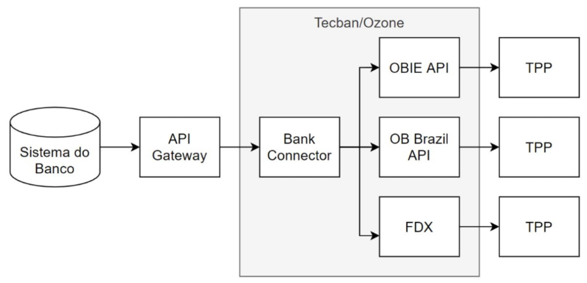
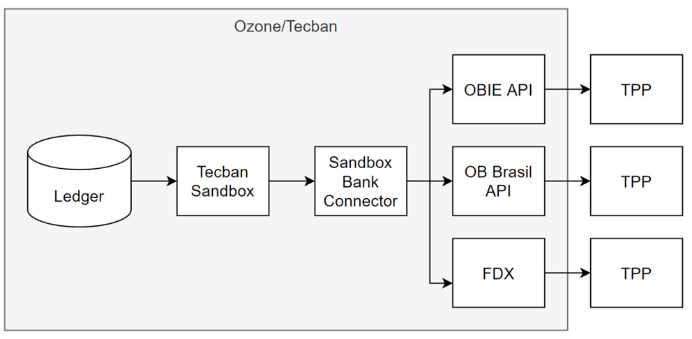

# Apresentação do Open Banking

- [1. Visão Geral](#visao_geral)
- [2. Plataforma de Open Banking](#1-plataforma_de_open_Banking)
- [3. Sandbox](#2-sandbox)
- [4. Papéis e Responsabilidade](#3-papeis_e_responsabilidades)
- [5. Glossário](#4-glossario)
- [6. Documentos de apoio](#6-documentos_de_apoio)

## 1. Visão Geral

A solução da TecBan foi projetada para permitir a entrada das instituições financeiras de forma segura e eficiente no ecossistema de open banking brasileiro. Ao Aderir essa solução, os bancos conseguirão focar os seus recursos tecnológicos e capital humano em projetos que gerem valor para os seus clientes e acionistas, ao passo que a Tecban se encarrega de manter a instituição compliance perante as demandas regulatórias.

A solução  Open Banking as a Service TecBan foi criada a partir da união das melhores práticas de open banking desenvolvidas no Reino Unido, com o conhecimento do mercado brasileiro de serviços financeiros da Tecban, a qual atua com muita expertise nesse segmento

## 2. Plataforma de Open Banking

Os bancos precisam de uma plataforma especializada para realizar a exposição de APIs, de maneira segura e fazer certo as coisas difíceis.
Os 6 pilares da Plataforma de Open Banking da TecBan, representam a solução para o problema acima.

Arquitetura simplificada da plataforma com possibilidade de exposição global no Openbanking de diversos países

## 3. Sandbox

## 4. Papéis e Responsabilidade

A figura abaixo representa em cinza os pontos do ecossistema do Open Banking que a Plataforma irá lhe apoiar:

# 5. Glossário

| Sigla| Descrição|Informação|
|----------------------------|
| API| Interface de programação de aplicativo|Uma interface de programação de aplicativo é um conjunto de rotinas, protocolos e ferramentas para construir aplicativos de software. Uma API especifica como os componentes de software devem interagir.
| FAPI| Financial API|Especificação técnica de API e define requisitos técnicos adicionais para o setor financeiro|
| CIBA| Client Initiated Backchannel Authentication|A autenticação de backchannel iniciada pelo cliente (CIBA) é um dos padrões mais recentes da OpenID Foundation. são categorizados como "fluxo desacoplado", Ele permite novas maneiras de obter o consentimento do usuário final|
| Oauth| Oauth|O OAuth é um protocolo de autorização para API's web voltado a permitir que aplicações client acessem um recurso protegido em nome de um usuário.|
| OIDC| OpenID Connect|OpenID Connect é um protocolo de identidade simples com padrão aberto|
| JWT| JSON Web Token|é uma técnica definida na RFC 7519 para autenticação remota entre duas partes. Ele é uma das formas mais utilizadas para autenticar usuários em APIs RESTful.|
| JWS| JSON Web Signature|é uma forma de garantir a integridade das informações em um formato altamente serializado|
| SHA256| Secure Hash Algorithm|é uma forma de garantir a integridade das informações em um formato altamente serializado|
| PKCE| Proof Key for Code Exchange|Chave de prova para troca de código por clientes públicos Oauth|
| MAC| Código de Autenticação de Mensagem|Permite que as declarações sejam assinadas digitalmente ou protegidas por integridade utilizando JWS|
| MTLS| Autenticação mútua|Chamamos de autenticação mútua quando ambos cliente e servidor apresentam certificados para serem validados pelo par.|
| CSR| Certificate Signing Request|Contém informação que irá ser incluída no seu certificado como o nome da empresa/organização, common name (domínio), localidade e país. Também contém a chave pública (public key) que será incluída no seu certificado. Normalmente é também criada uma chave privada (private key) ao mesmo tempo que é criado o CSR|
| TPP| Instituições Provedoras - Provedores terceirizados|As instituições provedoras são organizações que usam APIs desenvolvidas pelos ASPSP para acessar contas de clientes, a fim de fornecer serviços de informações de contas|
|ASPSP| Instituições Transmissoras - Provedor de serviços de pagamento de manutenção de contas|Um ASPSP é qualquer instituição financeira que oferece uma conta de pagamento com acesso online. Os ASPSPs devem fornecer acesso para permitir que terceiros (TPP) registrados acessem as informações da conta através de APIs|
| SSA| Software Statement Assertion|SSA é um JSON Web Token (JWT) que contém metadados sobre uma instância de aplicativo client desenvolvida por um TPP. O JWT é emitido e assinado pelo OpenBanking Directory.|
| JSON| JavaScript Object Notation|Json é um modelo para armazenamento e transmissão de informações no formato texto.|
| | End User|Identificação de usuário final que possui as informações que se deseja acessar|
| | Backend|Aplicação ou código que da inteligência de negocio as ações solicitadas via API , código que efetivamente realiza a função desejada|
| | Claims|São escopos/declarações usadas em uma API durante a autenticação para autorizar o acesso aos detalhes de um usuário, como nome e imagem por exemplo. Cada escopo retorna um conjunto de atributos do usuário, que são chamados de declarações.|
| | Header|É o cabeçalho de uma solicitação ou resposta que transmite contexto e metadados adicionais sobre a solicitação ou resposta. Por exemplo, em uma mensagem de solicitação podem ser usados para fornecer credenciais de autenticação.|
| | Payload|O Payload é a Carga Útil do token JWT. É aqui que você coloca informações como a quem o token pertence, qual a expiração dele, quando ele foi criado, entre outras coisas|

# 6. Documentos de apoio

| Versão                      | Descrição                                                         |
|-----------------------------|-------------------------------------------------------------------|
| Versão 2.2 Lançamento 26.4  | [Bank Connect PIS.yaml](https://docs.sfa.tecban.com.br/docs/open-banking-if-connect/assets/files/Bank_Connect_PIS.yaml)                                            |
| Versão 2.2 Lançamento 30.1  | [Bank Connect AIS APIs.yaml](https://docs.sfa.tecban.com.br/docs/open-banking-if-connect/assets/files/Bank_Connect_AIS_APIs.yaml)                                       |
| Versão 2.2 Lançamento 26.4  | [Consent Manager APIs.yaml](https://docs.sfa.tecban.com.br/docs/open-banking-if-connect/assets/files/Consent_Manager_APIs.yaml)                                        |
| Versão 2.2 Lançamento 26.4  | [Headless Heimdall APIs.yaml](https://docs.sfa.tecban.com.br/docs/open-banking-if-connect/assets/files/Headless_Heimdall_APIs.yaml)                                       |
| Versão 1.0                  | Plano de disaster recovery, nome do documento [Open_Banking_DR.doc](https://docs.sfa.tecban.com.br/docs/open-banking-if-connect/assets/files/Open_Banking_DR.doc) |
| Versão 1.01.01 - 05/03/2021 | [Jornadas de usuário](https://docs.sfa.tecban.com.br/docs/open-banking-if-connect/assets/files/Telas_das_jornadas_de_usuário_versão_final.pdf)                                           |