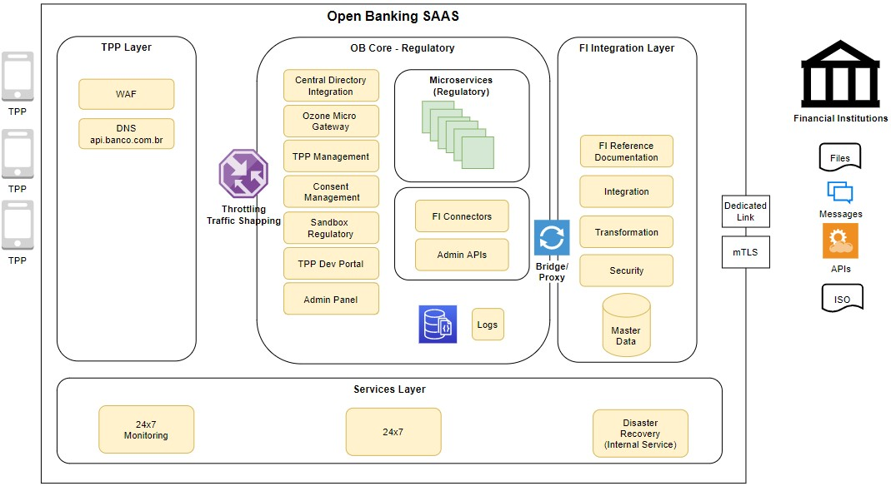
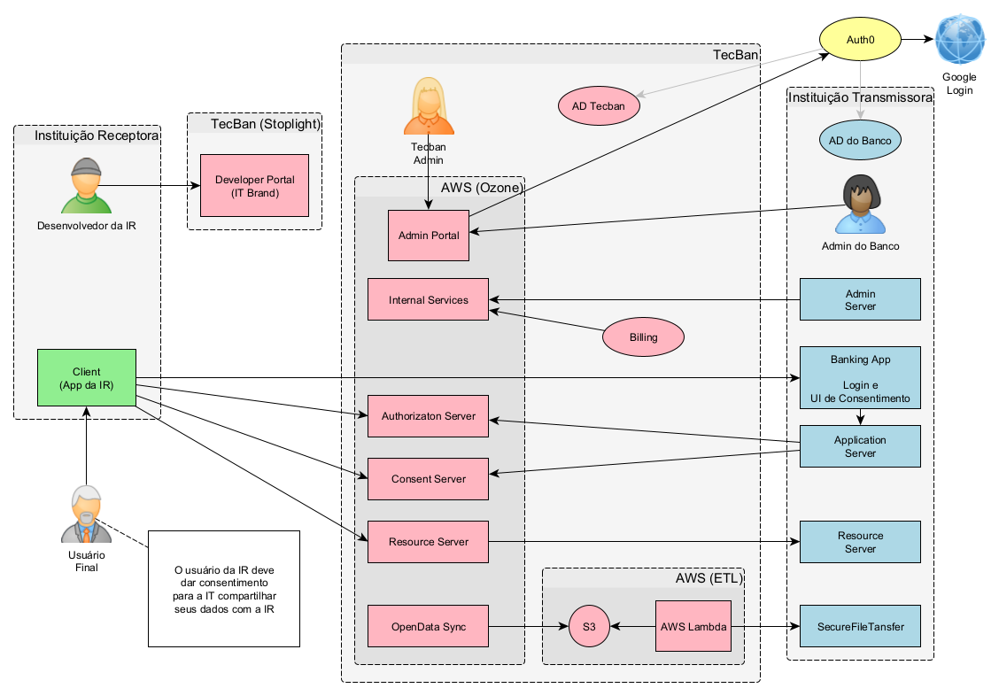

# Arquitetura do Sistema

- [1. Arquitetura](#1-arquitetura)
- [2. Desenho dos serviços](#2-desenho-dos-serviços)
- [3. Arquitetura do portal de consentimento](#3-arquitetura-do-portal-de-consentimento)
- [4. Visão Geral de Arquitetura do Open Finance TecBan](#4-visão-geral-de-arquitetura-do-open-finance-tecban)

# 1. Arquitetura

# 2. Desenho dos serviços

# 3. Arquitetura do portal de consentimento

# 4. Visão Geral de Arquitetura do Open Finance TecBan:

