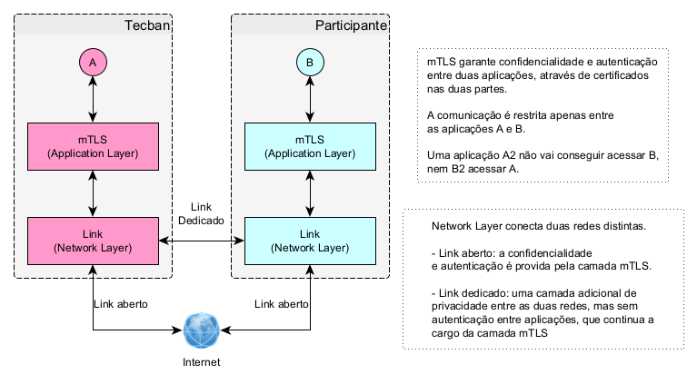

# Conectividade

Para a conectividade entre as **redes** da TecBan e a Instituição financeira estão disponíveis as seguintes modalidades:

- Internet
- Link dedicado
- Link dedicado RTM.

Na **camada de aplicação** a comunicação é feita pelo protocolo HTTPS (TLS v1.2)

> Para as Instituições Financeiras que ingressarem na rede Banco24Horas® será analisado o modelo de conectividade com a TecBan, que poderá envolver a contratação de link físico dedicado ou conectividade via internet. 

> Para as Instituições Financeiras que já ingressaram no Banco24Horas® haverá uma avaliação sobre o uso do link já existente.

# FAQ sobre conectividade

1. Quais são as opções de conectividade?

    São 3 modelos disponíveis, sendo: Internet, Link dedicado e Link dedicado RTM.

2. Quantos links são necessários se optarmos pelo link dedicado?

    São 3 links para garantir a alta disponibilidade, no caso da instituição optar por usar apenas 2 será necessário assinar uma carta de risco.

3. Posso utilizar a conexão via internet e depois migrar para um link dedicado?

    Sim é uma prática bem comum, para atender prazos agressivos ou simplesmente iniciar a integração da forma mais simples possível muitos parceiros utilizam essa estratégia.

4. O uso da VPN é uma opção para esse produto?

    Não, por ser uma tecnologia mais antiga e não agregar em segurança, já que o Mtls já faz o papel de assegurar a origem e destino.

5. Preciso utilizar o protocolo MTLS em todos os modelos de conectividade?

    Sim, a plataforma de Open Banking da TecBan nasceu atendendo aos padrões de segurança da regulação, remover o Mtls seria um downgrade de segurança, e não recomendamos essa prática.

6. Gostaria de aceitar chamadas somente dos IPs da TecBan, é possível?

    Sim, segue abaixo nossos IPs fixos de saída da AWS (Conectividade via internet), para que você possa por exemplo configurar estes IPs em uma camada WAF.
    - IP de Produção 177.71.135.59
    - IP de Desenvolvimento 18.229.67.128
    - IP de homologação 177.71.137.212

7. Qual a banda necessária para suportar a solução?

    Depende da previestimativa de volumetria, mas para te apoiar nessa análise tenha em mente que uma mensagem possui um tamanho em média de 2KB.
