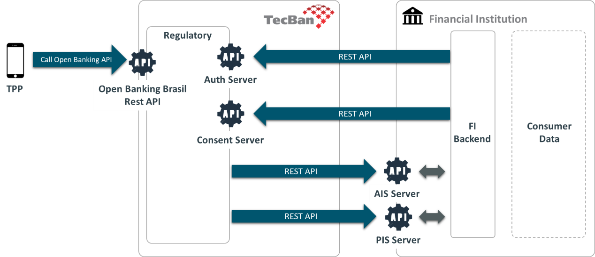

# Integração

O diagrama mostra as interfaces necessárias entre a Tecban e a IF.

## APIs Open Banking padrão

As APIs que são usadas pelas TPP e implementam o padrão Open Banking Brasil (OAuth, OIDC, FAPI), fazem parte da Plataforma TecBan, e não demandam nenhuma implementação por parte da IF.

A Plataforma Tecban permite que um ASPSP desenvolva a interface do usuário para PSUs sem ter que lidar com as complexidades de OIDC e FAPI e sem ter que obter um entendimento completo das restrições impostas pela FAPI.

## Autenticação do usuário

É de responsabilidade da IF realizar a autenticação do usuário através de uma **interface web** conforme os mecanismos já existentes na plataforma de _Internet Banking_ da instituição.

## Comunicação entre TecBan e Instituição Financeira

A comunicação entre TecBan e Instituição Financeira é realizada através de APIs padrão REST (https e json).

As APIs são especificadas através do padrão OpenAPI 3.0 (OAS3).

A autenticação entre as APIs TecBan e Instituição Financeira é baseada em mTLS 1.2.

É de responsabilidade da IF expor duas APIs:

- **AIS Server** - Essa API deve ser implementada pela IF para que a Tecban possa expor esses serviços às TPPs. Devem estar de acordo com a especificação OpenAPI 3.0 disponibilizada pela Tecban. Para o compartilhamento de dados (fase 2).

- **PIS Server** - Essa API deve ser implementada pela IF para que a Tecban possa expor serviços de pagamento para TPPs. Devem estar de acordo com a especificação OpenAPI 3.0 disponibilidade pela Tecban. Para pagamentos (fase 3).

É de responsabilidade da IF chamar as APIs da Tecban de acordo com o fluxo definido nos diagramas de sequência de Compartilhamento de Dados e Pagamentos. 
Devem ser chamados dois serviços existentes na plataforma Open Banking da Tecban:

- **Authorization Server** - devem ser chamados pela IF durante sua jornada de autorização.

- **Consent Server** - deve ser chamado pela IF para localizar, modificar e excluir consentimentos.

O detalhamento dessas integrações está descrito em

- [Compartilhamento de dados]()
- [Pagamentos]()
- [Portal de Consentimento]()
