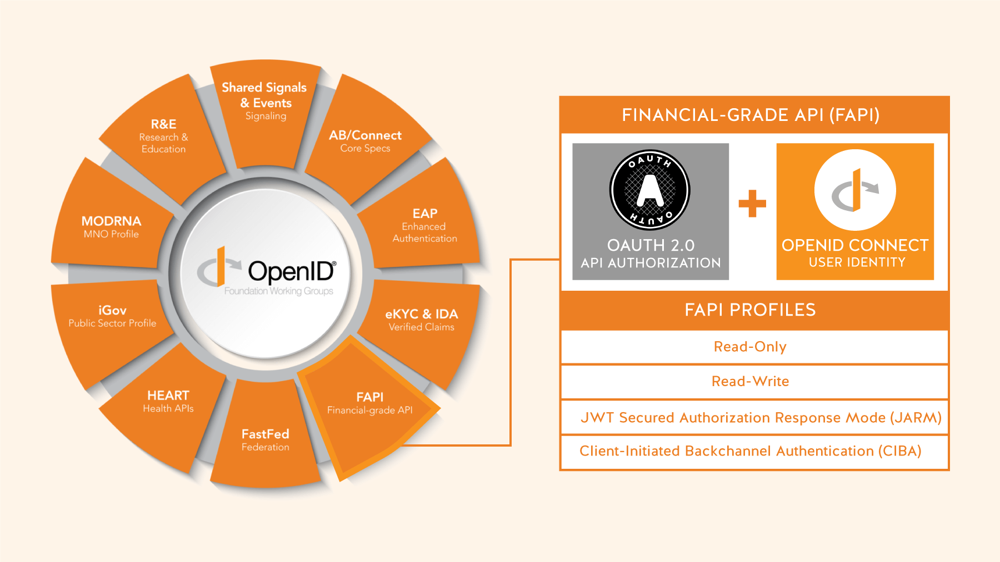
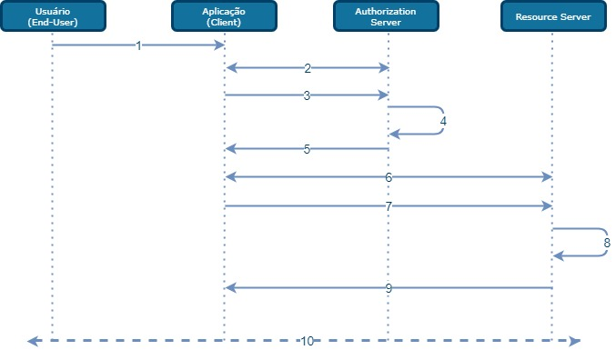

# Segurança

- [1. Padrões de Autenticação](#1-padrões-de-autenticação)
  - [1.1 OAuth 2.0](#11-oauth-20)
  - [1.2 OpenID Connect 2.0](#12-openid-connect-20)
  - [1.3 Financial-grade API (FAPI)](#13-financial-grade-api-fapi)
  - [1.4 Client Initiated Backchannel Authentication (CIBA)](#14-client-initiated-backchannel-authentication-ciba)
- [2. Tokens](#2-tokens)
  - [2.1 Token ID](#21-token-id)
- [3. JWT](#3-jwt)
- [4. Payload](#4-payload)
- [5. Assinatura](#5-assinatura)
- [6. Certificados](#6-certificados)
- [7. Armazenamento de chaves criptográficas (Cloud HSM)](#7-armazenamento-de-chaves-criptográficas-cloud-hsm)

# 1. Padrões de Autenticação

O Financial-grade API (FAPI) define uma serie de regras de como utilizar o OAuth 2.0 e OpenID Connect, de acordo com um padrão seguro para o setor financeiro.

# 1.1 OAuth 2.0
OAuth 2.0 é um framework que permite que um aplicativo de terceiros obtenha acesso limitado a um serviço HTTP, seja em nome de um proprietário de recurso orquestrando uma interação de aprovação entre o proprietário do recurso e o serviço HTTP ou permitindo que o terceiro aplicativo para obter acesso em seu próprio nome.

As especificações OAuth 2.0 são projetadas para oferecer suporte ao desenvolvimento de protocolos de autenticação e autorização. Ele fornece uma variedade de fluxos de mensagens padronizados baseados em JSON e HTTP; OpenID Connect os usa para fornecer serviços de identidade.

# 1.2 OpenID Connect 2.0

OpenID Connect 2.0 é um protocolo de autenticação interoperável baseado na família OAuth 2.0 de especificações. Ele usa fluxos de mensagens REST / JSON simplificados. O OpenID Connect 2.0 permite que os desenvolvedores autentiquem usuários em sites e aplicativos sem ter que possuir e gerenciar arquivos de senha.

Para criadores de aplicativos, o OpenID Connect 2.0 permite que o JavaScript baseado em navegador e aplicativos móveis nativos iniciem fluxos de entrada e recebam afirmações verificáveis sobre a identidade dos usuários conectados. Em termos simples, é uma resposta a “Qual é a identidade da pessoa que usa atualmente o navegador ou aplicativo nativo que está conectado?”

# 1.3 Financial-grade API (FAPI)

Financial-grade API (FAPI) é uma especificação liderada pelo setor finananceiro para esquemas de dados JSON, protocolos de segurança e privacidade para oferecer suporte a casos de uso para contas bancárias comerciais e de investimento, bem como contas de seguro e cartão de crédito.

FAPI visa fornecer diretrizes de implementação específicas para serviços financeiros online serem adotados por meio do desenvolvimento de um modelo de dados REST/JSON protegido por um perfil OAuth altamente seguro. O perfil de segurança da API de nível financeiro pode ser aplicado a serviços online em qualquer área de mercado que requeira um nível mais alto de segurança do que o fornecido pelo OAuth padrão ou OpenID Connect.

Os desenvolvedores FinTech podem acelerar o Secure Open Banking, por exemplo:

Aplicativos que usam um modelo de dados seguro baseado em padrões (JSON) para níveis de acesso a dados financeiros armazenados em contas.
Aplicativos que usam uma interface de programa baseada em padrões (REST) para compartilhamento de dados financeiros entre bancos, instituições e terceiros.
Controles de segurança de aplicativos e usuários e configurações de privacidade a serem implementados de forma consistente com padrões abertos (OAuth) e provedores (OpenID Connect).

# 1.4 Client Initiated Backchannel Authentication (CIBA)

O Financial-grade API (FAPI) inclui uma especificação de autenticação de backchannel iniciada pelo cliente (CIBA) para oferecer suporte a um método seguro de desacoplamento de casos de uso de autenticação e autorização para reduzir os riscos associados à engenharia social ou ameaça interna.

CIBA Core é uma nova especificação escrita pelo MODRNA Working Group da OpenID Foundation. A especificação adiciona três fluxos de autorização. O fluxo do código de autorização tradicional e o fluxo implícito são categorizados como “fluxo de redirecionamento”, enquanto os fluxos CIBA são categorizados como “fluxo desacoplado”. Fluxo desacoplado significa que o dispositivo que acessa a API e o dispositivo onde ocorre a autenticação do usuário e a confirmação do consentimento são distintos. por exemplo:

Aproveitando uma sessão fortemente autenticada "DE" um dispositivo inteligente para conceder autorização "PARA" outro dispositivo.
Pague COM seu telefone, relógio ou terminal / quiosque de ponto de venda ou qualquer outro tipo de dispositivo inteligente A um terceiro por meio de notificação PUSH.
Permitir que um agente de call center ou consultor financeiro acesse uma conta em vez de usar perguntas baseadas no conhecimento (por exemplo, nome de solteira da mãe).

# 2. Tokens
O OAuth 2.0 faz o uso de diversos tokens, entre eles, o access token, refresh token e Authorization "code".

Access token: Um token de acesso é utilizado por um client para acessar um recurso, geralmente possuem ciclo de vida curto (minutos ou horas), sendo consumidos durante uma sessão. O Access token indica que o client está autorizado a consumir um recurso protegido, respeitando os scopes para qual o token foi emitido. O token pode ser renovado através de um refresh token. O tipo de Access Token será o "Bearer" OAuth Access Token, referenciado em [RFC 6750].
Refresh token: Representa uma autorização de longa duração de um client. Esses tokens são trocados entre o client e o Authorization Server e são utilizados para obter (“atualizar”) novos tokens de acesso.
Authorization code: É um código de autorização que representa o resultado do processo de autorização bem sucedido do usuário final e é utilizado pelo client para obter acesso e atualizar status dos tokens.
É necessário a implementação de um endpoint adicional no Authorization Server que possibilita a revogação do Access Token e do Refresh Token. Um request de revogação invalidará um ou mais Tokens (se aplicável), baseados na mesma concessão de acesso, conforme [RFC 7009].
Também será adotado o OAuth Token Introspection que define um método para um recurso protegido consultar um Authorization Server sobre o estado e os metadados de um Token, conforme [RFC 7662].
Devido a ampla aplicação do uso do OAuth 2.0, as melhores práticas de segurança do OAuth 2.0 estão em constate atualização e podem ser consultadas neste endereço https://tools.ietf.org/html/draft-ietf-oauth-security-topics-16.

Início do fluxo de uma API com a obtenção de um Access Token.

Diagrama – Obtendo um Access Token.

1. Estabelece conexão TLS 1.2 entre o usuário e o client.
2. Estabelece conexão mTLS 1.2 entre o client e o Authorization Server.
3. Efetua um POST com as credenciais de autenticação do client e o escopo da solicitação.
4. Valida a autenticação de credenciais do client, o escopo e o certificado SSL.
5. Devolve o Access Token com a mensagem HTTP 200 (OK).
6. Estabelece conexão mTLS 1.2 entre o Client e o Resource Server.
7. Efetua um POST com o Access Token e o escopo.
8. Valida o Access Token, o escopo e o certificado.
9. Resposta com a mensagem HTTP 201 com o ID da transação.
10. Início do Hybrid Flow.

# 2.1 Token ID

ID Token
O OIDC utiliza o authorization code, access token e refresh token descrito na seção anterior sobre OAuth e define um outro tipo de Token, o ID Token.

ID Token: Um token utilizado para transmitir claims sobre um evento de autenticação e um usuário autenticado (End-user) para um client. Tokens de identificação são codificados em JSON Web Token (JWT) e deve estar em conformidade com a LGPD.
{"iss": "http://YOUR_DOMAIN/",
"sub": "xpto|123456",
"aud": "YOUR_CLIENT_ID",
"exp": "1311281970",
"iat": "1311280970",
"id": "1234567"}

UserInfo Endpoint: Retorna claims sobre um usuário autenticado. Chamar o endpoint requer um Access Token e as claims retornadas são regidos pelo Access Token.
Exemplo de resposta bem-sucedida contendo um ID Token assinado:

HTTP/1.1 200 OK
Content-Type: application/json
Cache-Control: no-store
Pragma: no-cache

{"access_token": "SlAV32hkKG",
"token_type": "Bearer",
"refresh_token": "8xLOxBtZp8",
"expires_in": "3600",
"id_token": "eyJhbGciOiJSUzI1NiIsImtpZCI6IjFlOWdkazcifQ.ewogImlzc
yI6ICJodHRwOi8vc2VydmVyLmV4YW1wbGUuY29tIiwKICJzdWIiOiAiMjQ4Mjg5
NzYxMDAxIiwKICJhdWQiOiAiczZCaGRSa3F0MyIsCiAibm9uY2UiOiAibi0wUzZ
fV3pBMk1qIiwKICJleHAiOiAxMzExMjgxOTcwLAogImlhdCI6IDEzMTEyODA5Nz
AKfQ.ggW8hZ1EuVLuxNuuIJKX_V8a_OMXzR0EHR9R6jgdqrOOF4daGU96Sr_P6q
Jp6IcmD3HP99Obi1PRs-cwh3LO-p146waJ8IhehcwL7F09JdijmBqkvPeB2T9CJ
NqeGpe-gccMg4vfKjkM8FcGvnzZUN4_KSP0aAp1tOJ1zZwgjxqGByKHiOtX7Tpd
QyHE5lcMiKPXfEIQILVq0pc_E2DzL7emopWoaoZTF_m0_N0YzFC6g6EJbOEoRoS
K5hoDalrcvRYLSrQAZZKflyuVCyixEoV9GfNQC3_osjzw2PAithfubEEBLuVVk4
XUVrWOLrLl0nx7RkKU8NXNHq-rvKMzqg"}

# 3. JWT
O formato JWT (JSON Web Token) é projetado para transmitir claims entre duas partes. O JWT consiste em um Header, um payload e uma assinatura. O cabeçalho do ID Token contém informações sobre o tipo de objeto (JWT) e o algoritmo de assinatura utilizado para proteger a integridade dos claims do payload. O algoritmo de assinatura exigido é o PS256 (RSASSA-PSS utilizando SHA-256 e MGF1 com SHA-256). A seção do payload contém as claims sobre um usuário e o evento de autenticação. A seção de assinatura contém uma assinatura digital com base no payload do ID Token e uma chave secreta conhecida pelo provedor OpenID.

O JWT é formado por três seções: Header, Payload e Signature.
O Header contém somente a informação tipo e algoritmo:

{"typ": "JWT",
"alg": " PS256"}

# 4. Payload
O Payload é um objeto JSON com as Claims da entidade tratada, normalmente o usuário autenticado.
Claims são informações afirmadas sobre um sujeito, por exemplo um ID Token, pode conter uma claim chamada name que afirma que o usuário autenticado é quem diz ser. Em um JWT uma claim aparece como um par nome/valor em que o nome é sempre uma string e o valor pode conter qualquer conteúdo JSON. Essas claims podem ser de 3 tipos:

Reserved claims: São claims definidas pela especificação do JWT e contém atributos não obrigatórios (mais recomendados) que são usados na validação do token pelos protocolos de segurança das APIs. É possível verificar a lista completa de Reserved Claims em [IANA JSON Web Token Claims Registry].

{"sub": "Subject, entidade à quem o token pertence, normalmente o ID do usuário",
"iss": "Issuer, emissor do token",
"exp": "Expiration, timestamp de quando o token irá expirar",
"iat": "Issued at, timestamp de quando o token foi criado",
"aud": "Audience, destinatário do token, representa a aplicação que irá usá-lo"}

Public claims: atributos utilizados nas aplicações. Normalmente armazenamos as informações do usuário autenticado na aplicação.

{"name": "Joe",
"roles": "Administrator",
"permissions": "Full"}

Private claims: são claims personalizadas e contém atributos definidos para compartilhar informações entre aplicações.

{"sub": "1234567890",
"name": "Jose Doe"
"admin": "true"}

Conjunto de claims para um ID Token do Open Banking:

{"iss": "Emissor do token",
"sub": "Identificador único do subject",
"openbanking_intent_id": "Intent ID da solicitação",
"aud": "Público alvo para o qual o ID Token é destinado (deve incluir o Client ID)",
"exp": "Data/hora de expiração do token",
"iat": "Data/hora de emissão do token",
"auth_time": "Data/hora de autenticação do End-user",
"nonce": "Valor string que associa uma sessão do cliente com um ID Token usado para ajudar na mitigação de ataques de replay",
"acr": "Authentication Context Class Reference",
"amr": "Authentication Methods References",
"azp": "Authorized party",
"s_hash": "State hash value",
"at_hash": "Access Token hash value",
"c_hash": "Code hash value"}

# 5. Assinatura
A assinatura é o header e o payload criptografados com um secret.

PS256(
base64UrlEncode(header) + "." +
base64UrlEncode(payload),
secret)

Para obter o token JWT, as três seções header (vermelho), payload (roxo) e signature (azul) são codificadas com Base64-URL e unidas por pontos.

eyJhbGciOiJIUzI1NiIsInR5cCI6IkpXVCJ9.eyJz
dWIiOiIxMjM0NTY3ODkwIiwibmFtZSI6IkpvaG4g
RG9lIiwiaWF0IjoxNTE2MjM5MDIyfQ.SflKxwRJSM
eKKF2QT4fwpMeJf36POk6yJV_adQssw5c

eyJhbGciOiJIUzI1NiIsInR5cCI6IkpXVCJ9. -> Header
eyJzdWIiOiIxMjM0NTY3ODkwIiwibmFtZSI6IkpvaG4gRG9lIiwiaWF0IjoxNTE2MjM5MDIyfQ. -> Payload
SflKxwRJSMeKKF2QT4fwpMeJf36POk6yJV_adQssw5c -> Signature

Este token JWT deve ser enviado no cabeçalho Authentication HTTP usando o esquema Bearer. O conteúdo do cabeçalho deve seguir este formato:

Authorization: Bearer

# 6. Certificados
Dois tipos de certificados serão emitidos pelo ICP-Brasil para serem utilizados no Open Banking com as funções de transporte e assinatura. Atributos comuns a ambos os certificados:

| Atributo| Utilização|
|----------------------------|
| Data de validade| Intervalo de tempo para qual o certificado será válido.|
| Data de emissão| Data em que foi emitido o certificado.|
| Autoridade Certificadora| AC- Autoridade Certificadora, entidade pública ou privada, subordinada à hierarquia da ICP-Brasil, responsável por emitir, distribuir, renovar, revogar e gerenciar certificados digitais.|
| Chave pública e privada| Chaves públicas e privadas.|
| Tipo| A1 ou A2 ou A3.|
| Código de registro do participante| 2.16.76.1.3.3 otherName Código que identifica o participante do Open Banking (CNPJ).|
| Nome do participante| 2.16.76.1.3.8 otherName Nome que identifica o participante do Open Banking (Nome que consta no CNPJ).|
| Código do Diretório (OID 2.16.76.1.3.X)| Campo otherName em certificado de pessoa jurídica, contendo identificação do código de participante junto ao diretório do Open Banking. OID a ser definido.|

# 7. Armazenamento de chaves criptográficas (Cloud HSM)

Todas as chaves criptográficas do sistema são armazenadas no AWS CloudHSM, um Hardware Security Module (HSM – Módulo de segurança de hardware) baseado na nuvem que permite armazenar com total segurança as suas próprias chaves de criptografia na Nuvem AWS. Com o CloudHSM, gerenciamos chaves de criptografia usando HSMs validados pelo FIPS 140-2 nível 3. 

