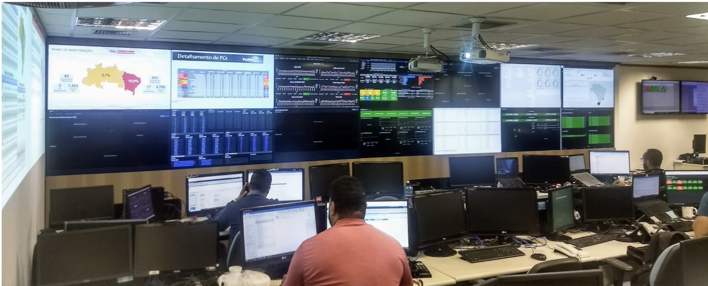
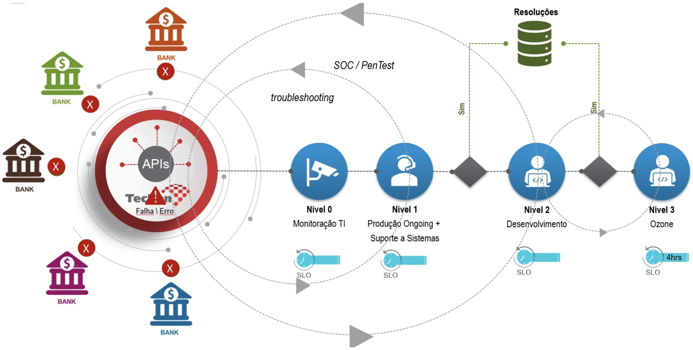
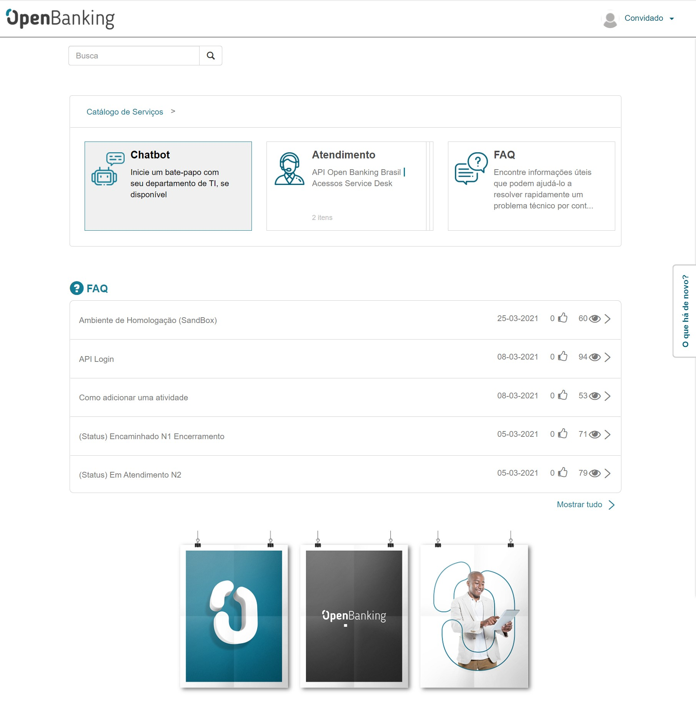

# Monitoria e Suporte

- [1. Monitoria do Ambiente](#1.-Monitoria)
- [2. Processo de Monitoria ](#-2.-Processo-de-Monitoria-e-SLA)
- [3. SLA](#2-definições-e-abreviaturas)
- [4. Suporte](#3-visão-geral)

# 1. Monitoria do Ambiente
Os ambientes produtivos são monitorados 24x7 por ferramentas de última geração que avisam imediatamente os operadores do centro de controle que conta com uma equipe técnica especializada para o pronto atendimento.

# 2. Processo de Monitoria

O processo de monitoria conta com 4 níveis de suporte em caso de falha ou erro das API´s
- Nivel 0 - Monitoração de TI via Splunk
- Nivel 1 - Produção + Suporte de Sistemas
- Nivel 2 - Desenvolvimento
- Nivel 3 - Ozone

# 3. SLA (Service Level Agreement)

O suporte eficaz da disponibilidade do Open Banking mantém níveis consistentes de serviços do sistema. Níveis de Serviço definidos:

- Cada endpoint da API deve estar disponível 95% do tempo durante cada período de 24 horas.
- Cada endpoint da API deve estar disponível 99.5% do tempo durante cada período de 3 meses.
- Cada endpoint da API deve retornar o primeiro byte de resposta dentro de 1000ms por 95% das requisiçãos.
- O tempo de resposta será medido por um cliente externo com uma latência de rede máxima de 50 ms (tempo para o primeiro byte).

Informativamente, esse nível de serviço representa aproximadamente um downtime máximo de 0,5% por trimestre, o que corresponde a 18s por hora, 7,2min (432s) por dia, 3,6h (216m) por mês e 10,8h (648m) por trimestre.

A definição de um período de indisponibilidade é qualquer período de tempo em que qualquer um dos endpoints da API definidos na norma é incapaz de fornecer uma resposta confiável a uma solicitação construída de forma apropriada.

# 4. Suporte aos Desenvolvedores

O Sistema da Tecban é totalmente integrado ao service desk do Openbanking onde todos os chamados dos nossos clientes são direcionados para os clientes e também para a area de suporte da Tecban e o mesmo será atendido dentro dos SLAs acordados com o Bacen contrato vigente com a Instituição Financeira

https://servicedesk.openbankingbrasil.org.br/

