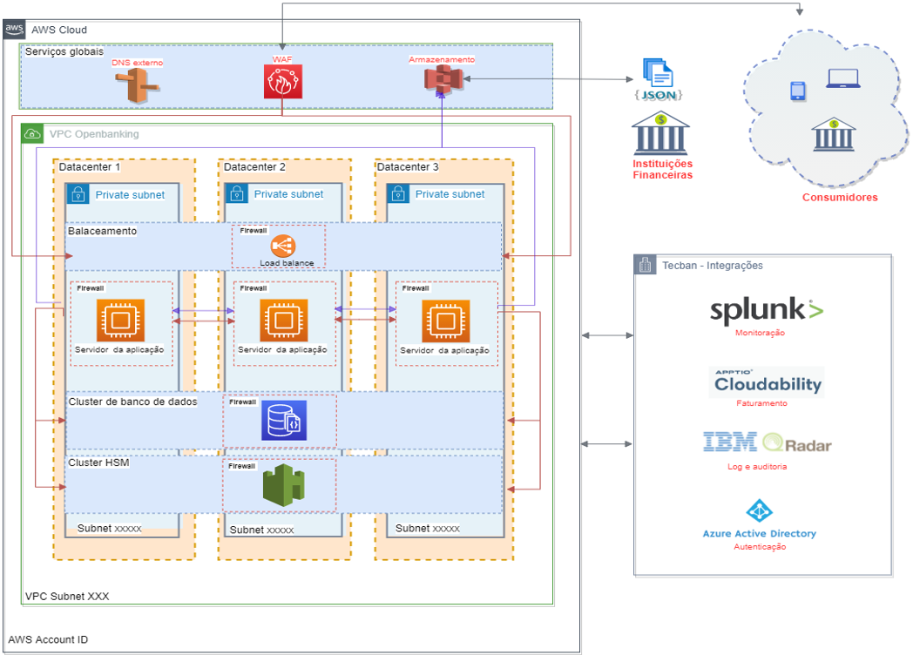

# Plano de Continuidade (RTO e RPO)

- [1. Detalhamento da Infraestrutura](#1-detalhamento-da-infraestrutura)
- [2	Procedimento Operacional](#2-procedimento-operacional)
- [3.	Backup e Recovery](#3-backup-e-recovery)
- [4.	Detalhamento da Solução de Contingência](#4-detalhamento-da-solução-de-contingência)
- [5. SPOF (Single Point of Failure)](#5-spof-single-point-of-failure)

Foram criadas contas AWS dedicadas ao projeto Open Finance, elas estão integradas ao QRADAR, Splunk, Azure AD, Apptio e outras ferramentas padrão da Tecban para monitoração para fins de auditoria. 

Todos os serviços estão alocados no Brasil em 3 datacenters (availability zones) no formato ativo/ativo. Para os serviços globais como IAM e Roles não há região específica. 

Toda infraestrutura é provisionada como código e serão detalhados neste documento. Abaixo está a lista de serviços criados.

# 1. Detalhamento da Infraestrutura

Os templates estão disponibilizados no repositório do Gitlbab.

•	VPC
Para o projeto Open Finance são criadas 3 novas VPCs em cada respectiva nova conta AWS e nomeadas seguindo a segmentação de cadeias da Tecban de DEV, HML, PROD e TRA.
 
•	Route 53
Mantém os registros dos endereços públicos e privados da aplicação.

•	Certificate Manager
Criação de certificados SSL que são usados para manter criptografadas as informações enviadas pela Internet para os endereços API criados pela aplicação.

•	Network LoadBalancer
Garante a alta disponibilidade e balanceamento de carga para as EC2. Possuem interface em 3 Availability Zones.

•	Application Load Balancer
Garante a alta disponibilidade e balanceamento de carga para as EC2. Possuem interface em 3 Availability Zones.

•	S3
Repositório de arquivos no formato JSON para processamento da aplicação.

•	EC2
Servidores virtuais que hospedam a aplicação. Os servidores virtuais estão distribuídos em 3 Availabilty Zone afim de garantir a alta disponibilidade da aplicação.

•	DocumentDB
Há um 1 cluster de com 2 instâncias distribuídos  em 2 Availability Zones para garantir a alta disponibilidade do banco de dados. 

•	Cloud Formation
Os serviços são provisionados através de templates, há um total de 9 scripts que efetuam o deploy de todos os serviços requeridos pela aplicação.

•	CloudHSM
Serviço de criptografia com algoritmos simétricos e assimétricos que entrará somente na Fase 2 do OpenFinance.

# 2	Procedimento Operacional
Referir-se ao documento de passagem para Produção “DIET_Openfinace.doc”

# 3.	Backup e Recovery

O backup será realizado pela ferramenta de backup da AWS via Snapshot que é armazenado por 30 dias para o banco de Dados DocumentDB.

Os demais serviços são desacoplados e não armazenam dados, tornando desnecessário a execução de backups.

Para restauração de um serviço em caso de incidente será necessário reexecutar os templates de Cloud Formation descritos na seção “3.3 – Procedimento operacional”.

Como segurança estes templates ficam armazenados no sistema de controle de versões Gitlab a fim de garantir versionamento. 

# 4.	Detalhamento da Solução de Contingência

A topologia da aplicação está em alta disponibilidade, utilizando zonas de datacenters ativo / ativo seguindo as melhores práticas de arquitetura recomendadas para serviços hospedados na AWS.

A disponibilidade (SLA) dos serviços estão documentadas no link abaixo:
https://aws.amazon.com/pt/legal/service-level-agreements/

# 5	SPOF (Single Point of Failure)

Não foi identificado ponto de falha único na aplicação pois todos os serviços utilizados são gerenciados pela AWS com SLA informado ou pela Tecban e possuem redundância.

