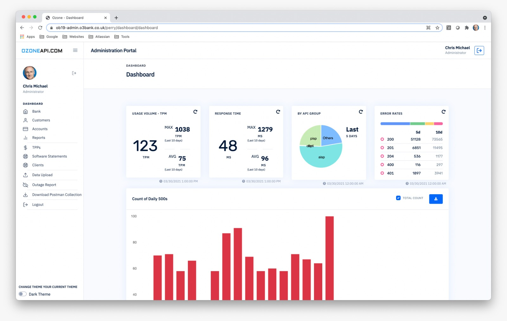
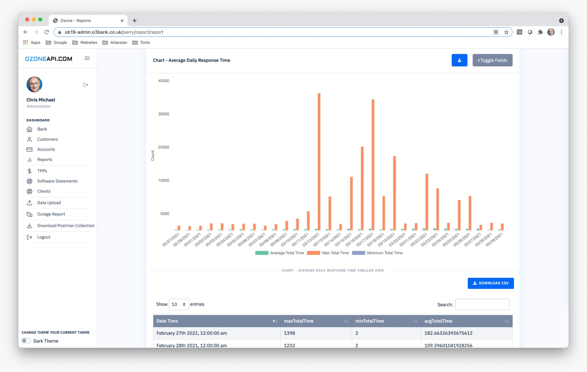
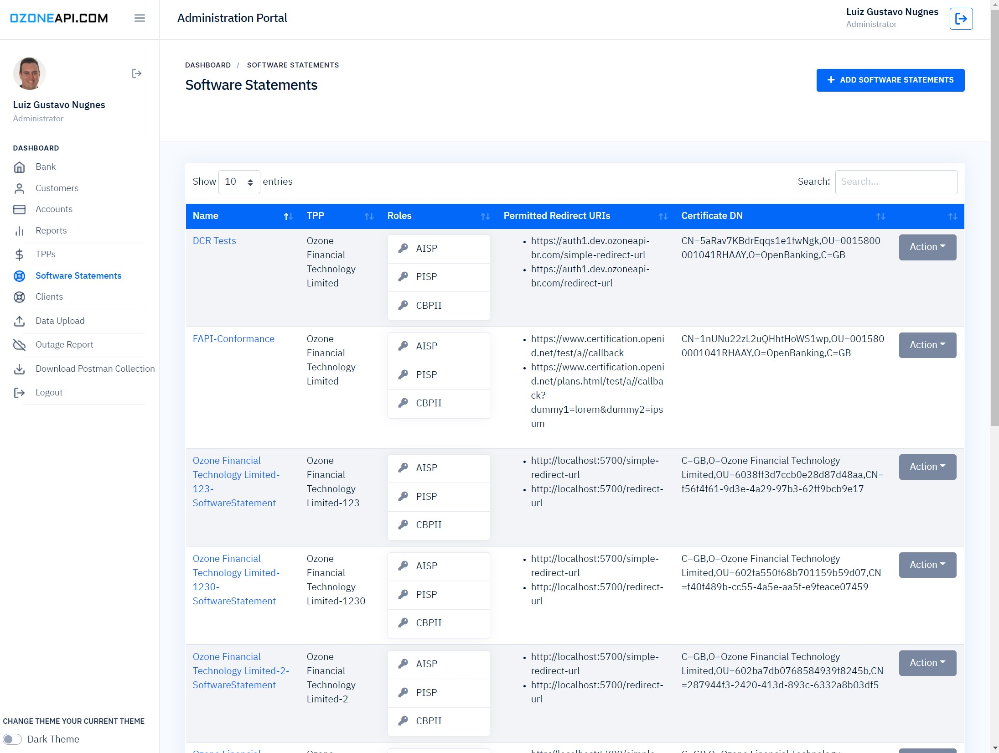
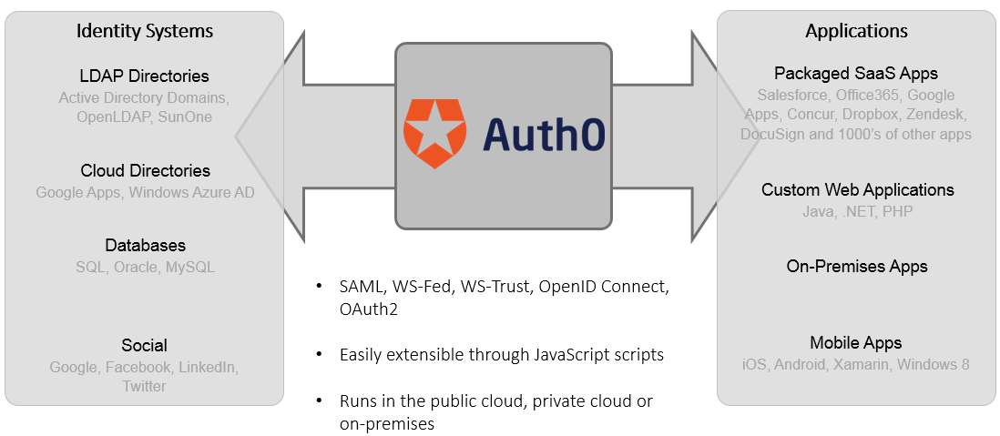

# Portal Administrativo *

- [1. Dashboard Inicial](#1-dashboard-inicial)
- [2. Relatórios de utilização das APIs](#2-relatórios-de-utilização-das-apis)
- [3. Gestão de Parceiros](#3-gestão-de-parceiros)
- [4. Autenticação via Auth0](#4-autenticação-e-federação-do-portal)
- [5. Segregação por Perfis de Acesso](#5-segregação-por-perfis-de-acesso)

A Plataforma de Open Banking da TecBan conta com um portal administrativo totalmente funcional para controle de parceiros e relatórios, acesso à plataforma totalmente parametrizado para um melhor acompanhamento da equipe responsável pelo OpenBanking na Instituição Financeira.

# 1. Dashboard Inicial
O Dashboard inicial conta com uma visão geral da plataforma e link para as principais funcionalidades do sistema.

# 2. Relatórios de utilização das APIs

Na [interface de relatório](https://admin.dev.ozoneapi-br.com/perry/report/report) os usuários podem consultar a utilização detalhada de todas as APIs do sistema.

# 3. Gestão de Parceiros

A plataforma fornece uma gestão independente do diretório central para o [acesso de parceiros](https://admin.dev.ozoneapi-br.com/perry/software-statement/software-statements) estratégicos com acordos bilaterais para a gestão dos certificados e controle de acesso.

# 4. Autenticação e Federação do Portal

A Autenticação da plataforma utiliza o [Auth0](https://auth0.com/authentication) como Hub para conexão com qualquer gestor de identidade do utilizado pela instituição financeira.
- LDAP
- Active Directory
- SAML

# 5. Segregação por Perfis de Acesso

Em contrução
