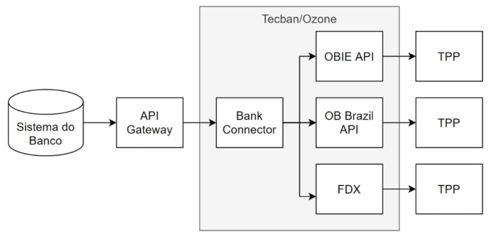
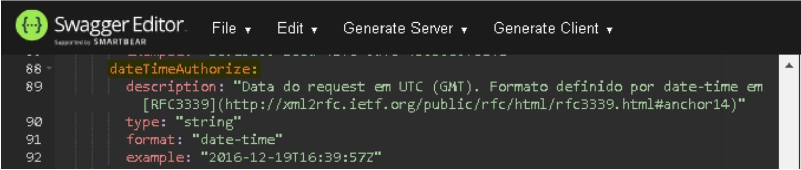

# Apresentação do Open Banking

- [Especificação Plataforma de Open Banking](#especificação-plataforma-de-open-banking)
- [1. Identificação do Documento](#1-identificação-do-documento)
- [2. Definições e Abreviaturas](#2-definições-e-abreviaturas)
- [3. Visão Geral](#3-visão-geral)
  - [3.1. Plataforma de Open Banking](#31-plataforma-de-open-banking)
  - [3.2. Arquitetura](#32-arquitetura)
    - [3.2.1. Visão de Serviços](#321-visão-de-serviços)
    - [3.2.2. Arquitetura de Referência](#322-arquitetura-de-referência)
  - [3.9. Relatórios e Logs](#39-relatórios-e-logs)
  - [3.10. Proposta Jornada do usuário](#310-proposta-jornada-do-usuário)
  - [3.11. Utilização do Swagger (OpenAPI 3)](#311-utilização-do-swagger-openapi-3)
  - [3.12. Esquema Swagger Tecban](#312-esquema-swagger-tecban)
- [7. Premissas e Restrições](#7-premissas-e-restrições)
- [8. Histórico de Alterações do Documento](#8-histórico-de-alterações-do-documento)
- [9. Documentos de apoio](#9-documentos-de-apoio)

# 1. Identificação do Documento

| Nome do Documento                        | Objetivo                                                                                                                                                                                                                                                                                                        |
|------------------------------------------|-----------------------------------------------------------------------------------------------------------------------------------------------------------------------------------------------------------------------------------------------------------------------------------------------------------------|
| Especificação Plataforma de Open Banking | Esta especificação permite que as Instituições Financeiras conectem seus sistemas à Plataforma SaaS que disponibiliza as APIs em nome de seus clientes (White-Label).   Facilidade para o compliance com o Open Banking no Brasil.   Uma solução segura e economicamente eficiente para as instituições financeiras. |

# 2. Definições e Abreviaturas	

| Termo               | Descrição                                                                                                                                                                                                                                                                                                                                                                             |
|---------------------|---------------------------------------------------------------------------------------------------------------------------------------------------------------------------------------------------------------------------------------------------------------------------------------------------------------------------------------------------------------------------------------|
| API                 | Application Programming Interface: conjunto de definições de métodos e funções que fornece uma biblioteca para ser utilizada por outros programas (no caso desse projeto, para páginas Web). De modo geral, a API é composta por uma série de funções acessíveis somente por programação, e que permitem utilizar características do software menos evidentes ao usuário tradicional. |
| IF                  | Instituição Financeira, Banco Digital, Parceiro ou Fintech.                                                                                                                                                                                                                                                                                                                           |
| Sandbox             | Ambiente para testes da aplicação.                                                                                                                                                                                                                                                                                                                                                    |
| APP                 | Aplicativo mobile transacional da Instituição Financeira.                                                                                                                                                                                                                                                                                                                             |
| Swagger             | Traduzido do inglês – O Swagger é um framework open source que facilita os desenvolvedores a desenhar, especificar e documentar suas APIs. Ele segue a iniciativa [Open API](https://www.openapis.org) que busca a padronização de APIs REST. Esse termo, descreve os recursos de suas APIs, como endpoints, parâmetros de entrada, objetos de retorno, códigos HTTP, métodos de autenticação, entre outros.     |
| Certificado Digital | Arquivo eletrônico que serve como identidade virtual para uma pessoa física ou jurídica, e por ele pode se fazer transações online com garantia de autenticidade e com toda proteção das informações trocadas.                                                                                                                                                                        |

# 3. Visão Geral

A solução da TecBan foi projetada para permitir a entrada das instituições financeiras de forma segura e eficiente no ecossistema de open banking brasileiro. Ao Aderir essa solução, os bancos conseguirão focar os seus recursos tecnológicos e capital humano em projetos que gerem valor para os seus clientes e acionistas, ao passo que a Tecban se encarrega de manter a instituição compliance perante as demandas regulatórias.

A solução  Open Banking as a Service TecBan foi criada a partir da união das melhores práticas de open banking desenvolvidas no Reino Unido, com o conhecimento do mercado brasileiro de serviços financeiros da Tecban, a qual atua com muita expertise nesse segmento

## 3.1. Plataforma de Open Banking

Os bancos precisam de uma plataforma especializada para realizar a exposição de APIs, de maneira segura e fazer certo as coisas difíceis.
Os 6 pilares da Plataforma de Open Banking da TecBan, representam a solução para o problema acima.

 

A figura abaixo representa em cinza os pontos do ecossistema do Open Banking que a Plataforma irá lhe apoiar:

## 3.2. Arquitetura

### 3.2.1. Visão de Serviços

[Imagem 1](../images/imagem_4.jpg)

### 3.2.2. Arquitetura de Referência

## 3.9. Relatórios e Logs

A ser especificado.

## 3.10. Proposta Jornada do usuário

Consultar o Guia [Jornadas de usuário.pdf](https://docs.sfa.tecban.com.br/docs/open-banking-if-connect/Jornadas%20de%20usuário.pdf), produzido pelo Grupo de Trabalho do Open Banking e aprovado pelo Banco Central.

## 3.11. Utilização do Swagger (OpenAPI 3)

Para visualizar o detalhamento dos campos que deseja consultar no swagger, basta acessar no [link](https://editor.swagger.io/).
Selecione “File/Import File” para importar os arquivos yml disponíveis juntamente com essa Especificação Técnica Funcional.

## 3.12. Esquema Swagger Tecban

 * **Formato date-time ( GMT +0 )**

Os swaggers da TecBan utilizam o padrão GMT + 0 nos campos com o formato “date-time”.
Dessa forma, ao consumir as APIs da TecBan utilizar esse esquema definido no swagger.
 
Exemplo:

# 7. Premissas e Restrições

Ao consumir as APIs da TecBan, a IF deverá enviar todos os campos respectivos ao date-time no padrão GMT+0.

# 8. Histórico de Alterações do Documento

| Versão | Data       | Autor                        | Alteração                          |
|--------|------------|------------------------------|------------------------------------|
| 1.0    | 23/02/2021 | Josué Jofre e Luiz Nugnes    | Criação do documento               |
| 1.1    | 15/03/2021 | Josué Jofre                  | Adicionado referência ao documento |
| 1.2    | 31/03/2021 | Alexandro T. Netto           | Documentação no Stoplight          |
| 1.2    | 06/04/2021 | Luiz Gustavo Nugnes          | Adequação à proposta comercial     |

# 9. Documentos de apoio

| Versão                      | Descrição                                                         |
|-----------------------------|-------------------------------------------------------------------|
| Versão 2.2 Lançamento 26.4  | [Bank Connect PIS.yaml](https://docs.sfa.tecban.com.br/docs/open-banking-if-connect/Bank%20Connect%20PIS.yaml)                                            |
| Versão 2.2 Lançamento 30.1  | [Bank Connect AIS APIs.yaml](https://docs.sfa.tecban.com.br/docs/open-banking-if-connect/Bank%20Connect%20AIS%20APIs.yaml)                                       |
| Versão 2.2 Lançamento 26.4  | [Consent Manager APIs.yaml](https://docs.sfa.tecban.com.br/docs/open-banking-if-connect/Consent%20Manager%20APIs.yaml)                                        |
| Versão 2.2 Lançamento 26.4  | [Headless Heimdall APIs.yaml](https://docs.sfa.tecban.com.br/docs/open-banking-if-connect/Headless%20Heimdall%20APIs.yaml)                                       |
| Versão 1.0                  | Plano de disaster recovery, nome do documento [Open_Banking_DR.doc](https://docs.sfa.tecban.com.br/docs/open-banking-if-connect/Open_Banking_DR.doc) |
| Versão 1.01.01 - 05/03/2021 | [Jornadas de usuário.pdf](https://docs.sfa.tecban.com.br/docs/open-banking-if-connect/Jornadas%20de%20usuário.pdf)                                           |