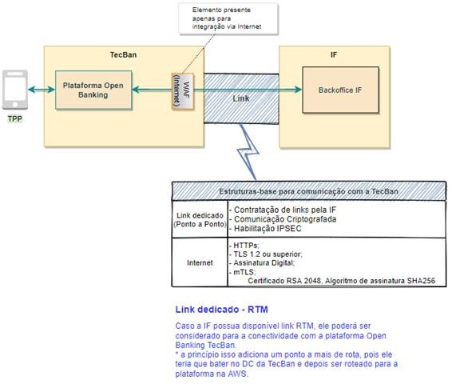

# Conectividade

- [Conectividade entre Redes](#especificação-plataforma-de-open-banking)
- [1. Link Dedicado](#1-identificação-do-documento)
- [2. MTLS](#3-visão-geral)
- [3. VPC](#4-visão-geral)

Para as Instituições Financeiras que ingressarem na rede Banco24Horas® será analisado o modelo de conectividade com a TecBan, que poderá envolver a contratação de link físico dedicado ou conectividade via internet. 
	

Para as Instituições Financeiras que já ingressaram no Banco24Horas® haverá uma avaliação sobre o uso do link já existente.

