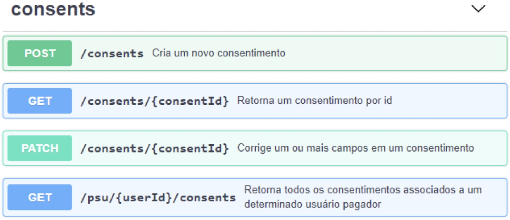
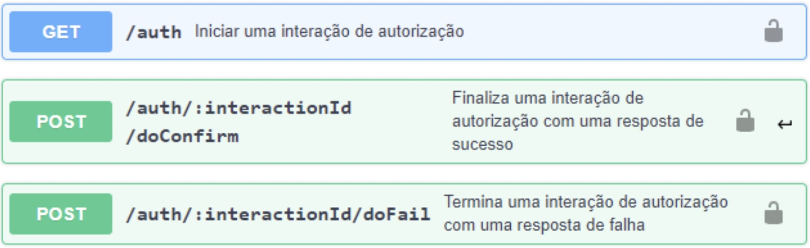
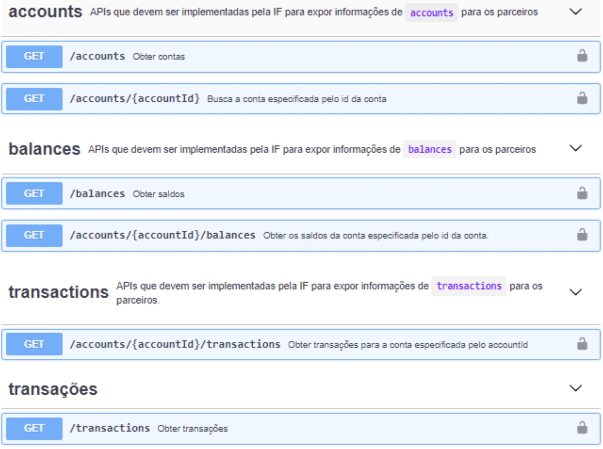
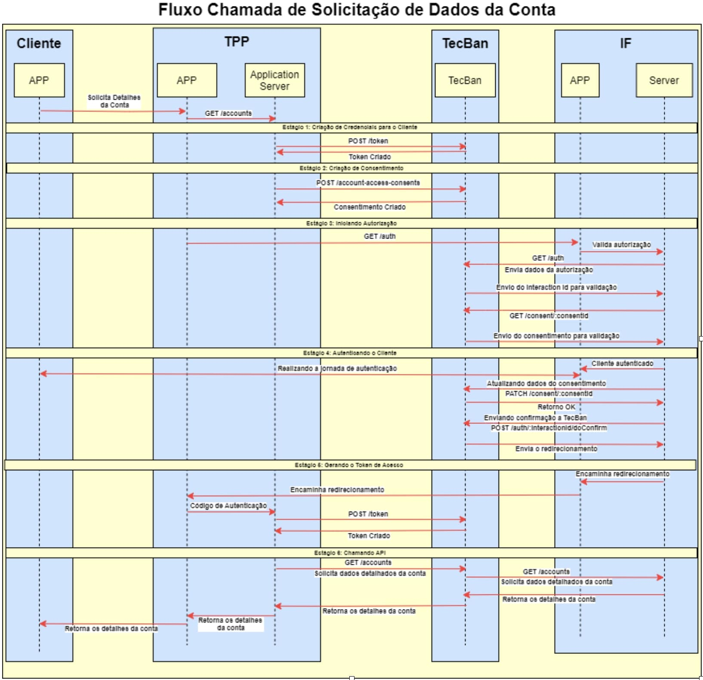
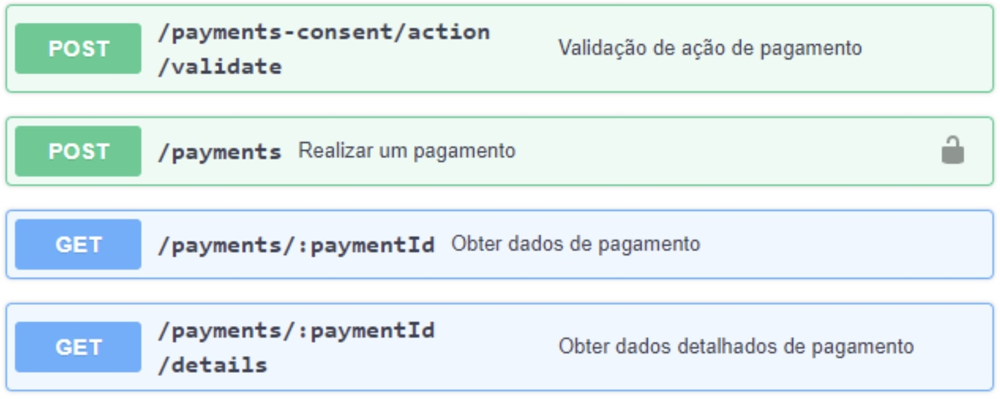
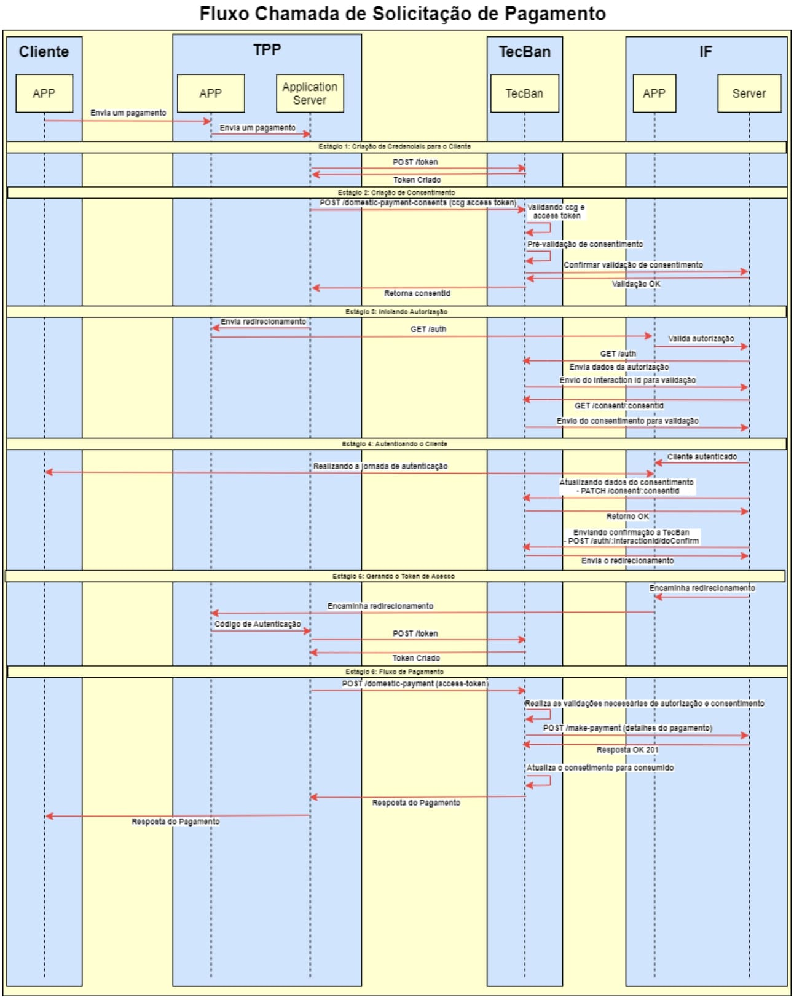

# Conector com IF

- [Conectividade entre Redes](#especificação-plataforma-de-open-banking)
- [1. Link Dedicado](#1-identificação-do-documento)
- [2. VPN](#2-definições-e-abreviaturas)
- [3. MTLS](#3-visão-geral)
- [4. VPC](#4-visão-geral)

# 1. Integração com instituições financeiras

O diagrama a seguir mostra as interfaces necessárias entre a Tecban e a IF.

É de responsabilidade da IF expor duas APIs:

**AIS Server** - Essa API deve ser implementada pela IF para que a Tecban possa expor esses serviços as TPPs. Devem estar de acordo com a especificação OpenAPI 3.0 disponibilizada pela Tecban. Vide seção xxx.

Funcionalidades:
  * accounts
  * balances
  * transactions
  * customer
  * direct-debits
  * scheduled-payments
  * standing-orders
  * offers
  * beneficiaries

**PIS Server** - Essa API deve ser implementada pela IF para que a Tecban possa expor serviços de pagamento para TPPs. Devem estar de acordo com a especificação OpenAPI 3.0 disponibilidada pela Tecban. Vide seção xxx.

Funcionalidades:
  * payments
  * payments-consent

É de responsabilidade da IF chamar as APIs da Tecban de acordo com o fluxo definido nos diagramas de sequência em xxx.

Devem ser chamados dois serviços existentes na plataforma Open Banking da Tecban:

**Authorization Server** - devem ser chamados pela IF no final de suas viagens de autorização.
A interface permite que um ASPSP desenvolva a interface do usuário para PSUs sem ter que lidar com as complexidades de OIDC e FAPI e sem ter que obter um entendimento completo das restrições impostas pela FAPI.

Funcionalidades:
  * auth
  * auth-confirm
  * auth-fail

**Consent Server** - deve ser chamado pela IF para localizar, modificar e excluir consentimentos.

Funcionalidades:
  * consents
  * psu

# 3.4. Conectores Com a plataforma de Open Banking

A TecBan possui um padrão próprio para integração e oferece a possibilidade de customização do formato de troca de mensagens com as instituições financeiras. 

# 3.5. Conectores para gerenciamento do consentimento (Implementação TecBan)

Este seção fornece a especificação para as APIs fornecidas pela TecBan para gerenciamento de consentimento.

Essas APIs são implementadas pela TecBan e devem ser chamadas pelo banco para localizar, modificar e excluir consentimentos.

***Para detalhamento dos campos consultar arquivo [Consent Manager APIs.yaml](https://docs.sfa.tecban.com.br/docs/open-banking-if-connect/Consent%20Manager%20APIs.yaml)**

# 3.6. Conectores para o servidor de autorização (Implementação TecBan)

Este documento fornece a especificação para as APIs de autorização.
Essas APIs são implementadas pela TecBan e devem ser chamadas pelo banco no final de suas jornadas de autorização.

***Para detalhamento dos campos consultar o arquivo [Headless Heimdall APIs.yaml](https://docs.sfa.tecban.com.br/docs/open-banking-if-connect/Headless%20Heimdall%20APIs.yaml)**

# 3.7. Conectores para dados do cliente (2º Fase) (Implementação Banco)

APIs que devem ser implementadas pelos bancos para expor informações de contas os parceiros.

***Para detalhamento dos campos consultar [Bank Connect AIS APIs.yaml](https://docs.sfa.tecban.com.br/docs/open-banking-if-connect/Bank%20Connect%20AIS%20APIs.yaml)**

# 3.8. Conectores para iniciação de pagamentos (3º Fase) (Implementação Banco)

Este documento fornece as especificações para que as instituições iniciadoras de pagamento possam utilizer a plataforma

Essas APIs devem ser implementadas pelos bancos para que a TecBan possa fornecer recursos de iniciação de pagamento para os Terceiros

***Para detalhamento dos campos consultar o [Bank Connect PIS.yaml](https://docs.sfa.tecban.com.br/docs/open-banking-if-connect/Bank%20Connect%20PIS.yaml)**

