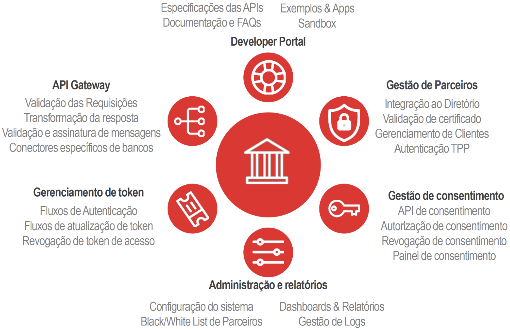
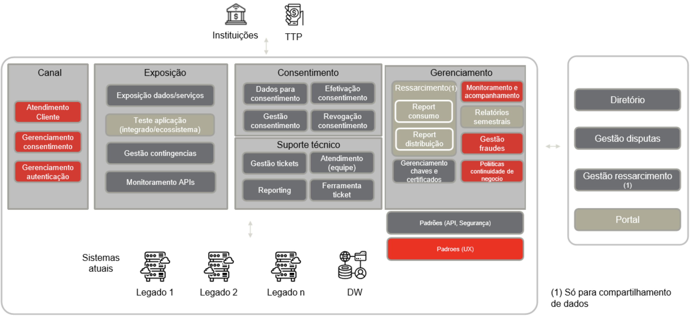
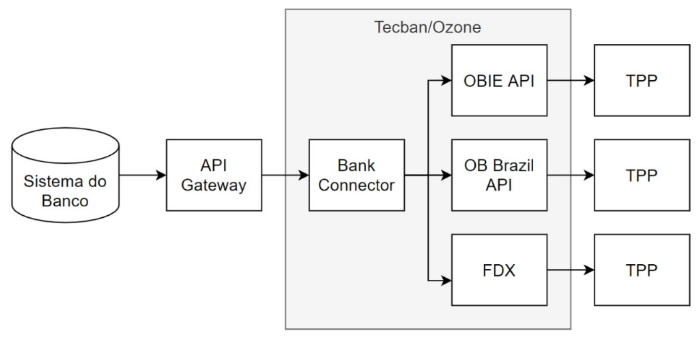
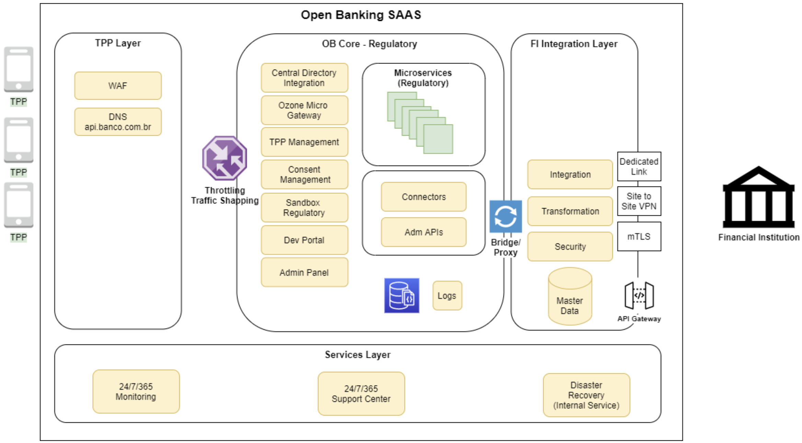

# Especificação Plataforma de Open Banking

- [1. Identificação do Documento](#1-identificação-do-documento)
- [2. Definições e Abreviaturas](#2-definições-e-abreviaturas)
- [3. Visão Geral](#3-visão-geral)
  - [3.1. Plataforma de Open Banking](#31-plataforma-de-open-banking)
  - [3.2. Arquitetura](#32-arquitetura)
    - [3.2.1. Visão de Serviços](#321-visão-de-serviços)
    - [3.2.2. Arquitetura de Referência](#322-arquitetura-de-referência)
  - [3.3. Integração com instituições financeiras](#33-integração-com-instituições-financeiras)
  - [3.4. Conectores Com a plataforma de Open Banking](#34-conectores-com-a-plataforma-de-open-banking)
  - [3.5. Conectores para gerenciamento do consentimento (Implementação TecBan)](#35-conectores-para-gerenciamento-do-consentimento-implementação-tecban)
  - [3.6. Conectores para o servidor de autorização (Implementação TecBan)](#36-conectores-para-o-servidor-de-autorização-implementação-tecban)
  - [3.7. Conectores para dados do cliente (2º Fase) (Implementação Banco)](#37-conectores-para-dados-do-cliente-2º-fase-implementação-banco)
  - [3.8. Conectores para iniciação de pagamentos (3º Fase) (Implementação Banco)](#38-conectores-para-iniciação-de-pagamentos-3º-fase-implementação-banco)
  - [3.9. Relatórios e Logs](#39-relatórios-e-logs)
  - [3.10. Proposta Jornada do usuário](#310-proposta-jornada-do-usuário)
  - [3.11. Utilização do Swagger (OpenAPI 3)](#311-utilização-do-swagger-openapi-3)
  - [3.12. Esquema Swagger Tecban](#312-esquema-swagger-tecban)
- [4. Monitoração](#4-monitoração)
- [5. Segurança](#5-segurança)
  - [5.1. Introdução](#51-introdução)
  - [5.2. Segurança nas APIs](#52-segurança-nas-apis)
  - [5.3. Geração do Token JWT](#53-geração-do-token-jwt)
  - [5.4. Conectividade - Integração via internet ou API Gateway Privado (Link Dedicado ou VPN)](#54-conectividade---integração-via-internet-ou-api-gateway-privado-link-dedicado-ou-vpn)
  - [5.5. Certificado Digital](#55-certificado-digital)
- [6. Ambiente Sandbox](#6-ambiente-sandbox)
- [7. Premissas e Restrições](#7-premissas-e-restrições)
- [8. Histórico de Alterações do Documento](#8-histórico-de-alterações-do-documento)
- [9. Documentos de apoio](#9-documentos-de-apoio)

# 1. Identificação do Documento

| Nome do Documento                        | Objetivo                                                                                                                                                                                                                                                                                                        |
|------------------------------------------|-----------------------------------------------------------------------------------------------------------------------------------------------------------------------------------------------------------------------------------------------------------------------------------------------------------------|
| Especificação Plataforma de Open Banking | Esta especificação permite que as Instituições Financeiras conectem seus sistemas à Plataforma SaaS que disponibiliza as APIs em nome de seus clientes (White-Label).   Facilidade para o compliance com o Open Banking no Brasil.   Uma solução segura e economicamente eficiente para as instituições financeiras. |

# 2. Definições e Abreviaturas	

| Termo               | Descrição                                                                                                                                                                                                                                                                                                                                                                             |
|---------------------|---------------------------------------------------------------------------------------------------------------------------------------------------------------------------------------------------------------------------------------------------------------------------------------------------------------------------------------------------------------------------------------|
| API                 | Application Programming Interface: conjunto de definições de métodos e funções que fornece uma biblioteca para ser utilizada por outros programas (no caso desse projeto, para páginas Web). De modo geral, a API é composta por uma série de funções acessíveis somente por programação, e que permitem utilizar características do software menos evidentes ao usuário tradicional. |
| IF                  | Instituição Financeira, Banco Digital, Parceiro ou Fintech.                                                                                                                                                                                                                                                                                                                           |
| Sandbox             | Ambiente para testes da aplicação.                                                                                                                                                                                                                                                                                                                                                    |
| APP                 | Aplicativo mobile transacional da Instituição Financeira.                                                                                                                                                                                                                                                                                                                             |
| Swagger             | Traduzido do inglês – O Swagger é um framework open source que facilita os desenvolvedores a desenhar, especificar e documentar suas APIs. Ele segue a iniciativa [Open API](https://www.openapis.org) que busca a padronização de APIs REST. Esse termo, descreve os recursos de suas APIs, como endpoints, parâmetros de entrada, objetos de retorno, códigos HTTP, métodos de autenticação, entre outros.     |
| Certificado Digital | Arquivo eletrônico que serve como identidade virtual para uma pessoa física ou jurídica, e por ele pode se fazer transações online com garantia de autenticidade e com toda proteção das informações trocadas.                                                                                                                                                                        |

# 3. Visão Geral

## 3.1. Plataforma de Open Banking

Os bancos precisam de uma plataforma especializada para realizar a exposição de APIs, de maneira segura e fazer certo as coisas difíceis.
Os 6 pilares da Plataforma de Open Banking da TecBan, representam a solução para o problema acima.

 

A figura abaixo representa em cinza os pontos do ecossistema do Open Banking que a Plataforma irá lhe apoiar:

## 3.2. Arquitetura

### 3.2.1. Visão de Serviços

### 3.2.2. Arquitetura de Referência

## 3.3. Integração com instituições financeiras

## 3.4. Conectores Com a plataforma de Open Banking

## 3.5. Conectores para gerenciamento do consentimento (Implementação TecBan)

## 3.6. Conectores para o servidor de autorização (Implementação TecBan)

## 3.7. Conectores para dados do cliente (2º Fase) (Implementação Banco)

## 3.8. Conectores para iniciação de pagamentos (3º Fase) (Implementação Banco)

## 3.9. Relatórios e Logs

## 3.10. Proposta Jornada do usuário

## 3.11. Utilização do Swagger (OpenAPI 3)

## 3.12. Esquema Swagger Tecban

# 4. Monitoração

# 5. Segurança
## 5.1. Introdução
## 5.2. Segurança nas APIs
## 5.3. Geração do Token JWT
## 5.4. Conectividade - Integração via internet ou API Gateway Privado (Link Dedicado ou VPN)
## 5.5. Certificado Digital

# 6. Ambiente Sandbox

# 7. Premissas e Restrições

# 8. Histórico de Alterações do Documento

# 9. Documentos de apoio