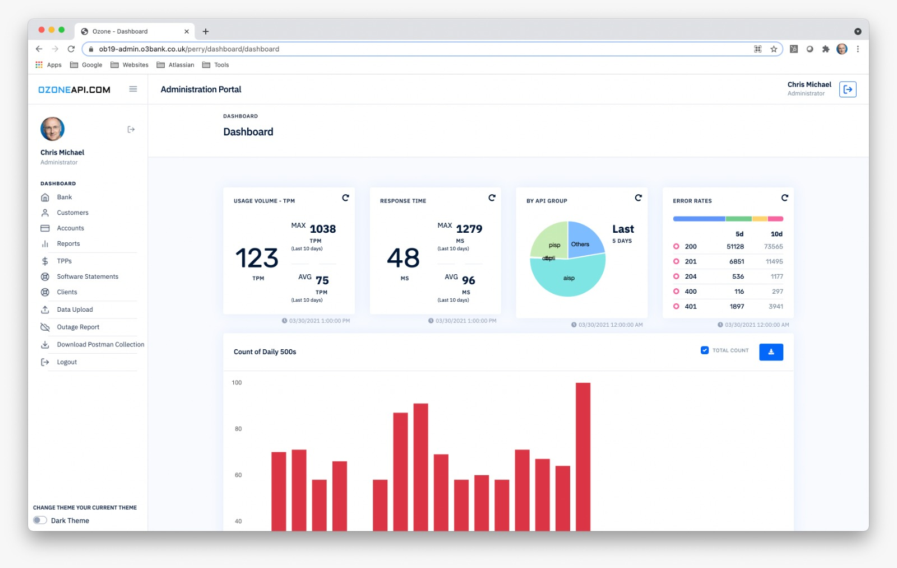

# Portal Administrativo

- [1. Dashboard Inicial](#2)
- [2. Relatórios de utilização das APIs](#3)
- [3. Gestão de Parceiros](#3)
- [4. Autenticação via Auth0](#4)

A Plataforma de Open Banking da TecBan conta com um portal administrativo totalmente funcional para controle de parceiros e relatórios acesso à plataforma totalmente parametrizado para um melhor acompanhamento da equipe responsável pelo OpenBanking na Isntituição Financeira.

# 1. Dashboard Inicial
O Dashboard inicial conta com uma visão geral da plataforma e link para as principais funcionalidades do sistema.

# 2. Relatórios de utilização das APIs

Na interface de relatório os usuários podem consultar a utilização detalhada de todas as APIs do sistema.

https://admin.dev.ozoneapi-br.com/perry/report/report

# 2. Gestão de Parceiros

A plataforma fornece uma gestão independente do diretório central para a acesso de parceiros estratégicos com acordos bilaterais para a gestão dos certificados e controle de acesso.

https://admin.dev.ozoneapi-br.com/perry/software-statement/software-statements

# 4. Autenticação e Federação do Portal

A Autenticação da plataforma utiliza o Auth0 (https://auth0.com/authentication) como Hub para conexão com qualquer gestor de identidade do utilizado pela fnstituição financeira.
- LDAP
- Active Directory
- SAML

# 3. Segregação por Perfis de Acesso

