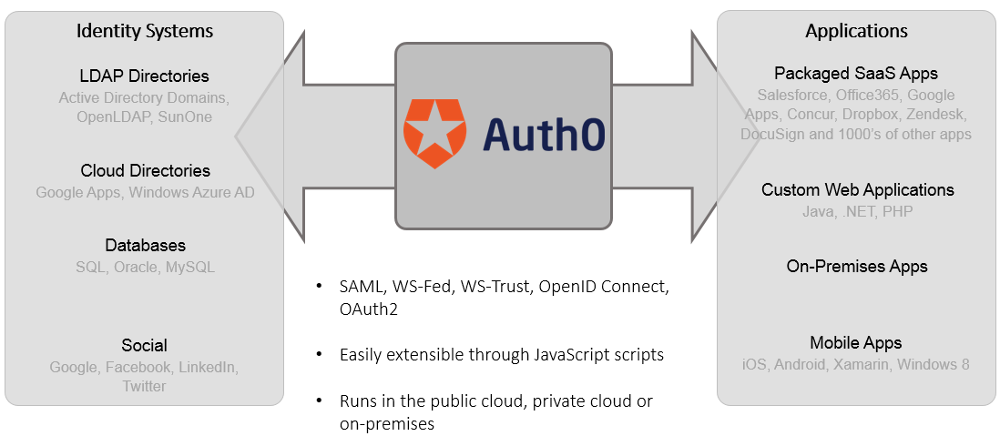

# Portal Administrativo

- [1. Dashboard Inicial](#2)
- [2. Gestão de Parceiros](#3)
- [3. Relatórios de utilização das APIs](#3)
- [4. Autenticação via Auth0](#4)

# 1. Dashboard Inicial

# 2. Gestão de Parceiros

https://admin.dev.ozoneapi-br.com/perry/software-statement/software-statements

# 3. Relatórios de utilização das APIs

https://admin.dev.ozoneapi-br.com/perry/report/report

# 4. Autenticação via Auth0

# 3. Segregação por perfis de acesso
