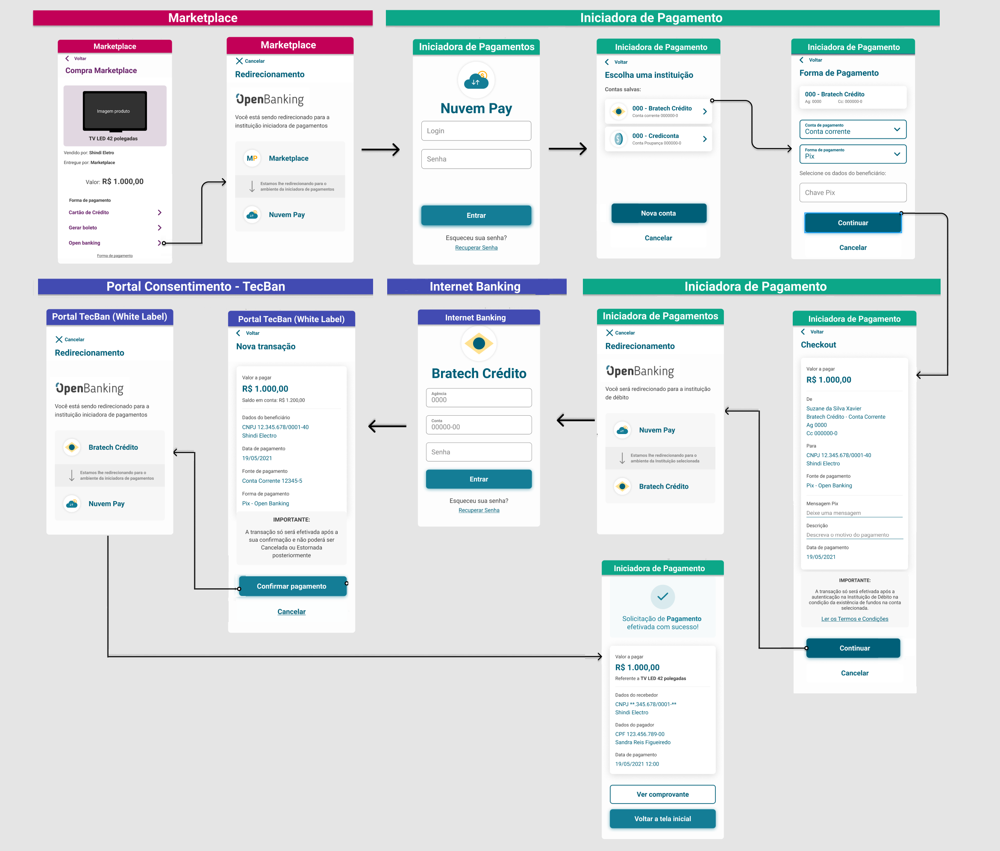

# Portal de Consentimento 
- [1. O que é o Portal do Consentimento?](#1-o-que-e-o-portal-do-consentimento-?)
- [2. Jornada de Usuário](#2-jornada-de-usuario)
- [3. Experiência dos Usuários](#7-experiência-dos-usuários)
  - [3.1 Login do Cliente](#28-login-do-cliente)
  - [3.2 Alçada Única](#31-alçada-única)
  - [3.3 Dupla Alçada](#34-dupla-alçada)
  - [3.4 Gestão do Consentimento](#37-gestão-do-consentimento)
  - [4. Fuxo de Autenticação dos Usuários](#40-autenticacao-usuario)


# 1. O que é o Portal de Consentimento?
O Portal do Consentimento é o conjunto de interfaces que permite que os clientes das Instituições Financeiras façam a gestão de seus consentimentos. 

É uma solução opcional oferecida pela TecBan para adequar a experiência do usuário em sua jornada de consentimento, atendendo as recomendações do Grupo de Trabalho do Open Banking Brasil

# 2. Jornadas de Usuário
Nos fluxos abaixo serão ilustradas as principais funcionalidades da 'Gestão de Consentimentos' pela perspectiva do usuário.

**Fluxo:** **Confirmar Consentimento de Pagamento Único - Alçada Única**

Navegue pelo protótipo (Clique)[aqui](https://www.figma.com/proto/aWwbavLPVAbx0H2AdnSQxi/Untitled?node-id=1%3A387&scaling=min-zoom&page-id=0%3A1)



# 3. Experiência dos Usuários

# 3.1 Login do Cliente


# 3.2 Alçada Única


# 3.3 Dupla Alçada


# 3.4 Gestão do Consentimento


# 4. Fuxo de Autenticação dos Usuários


Para a comunicação entre Internet Banking da IF e Portal de Consentimento, será feito um
redirecionamento para o portal de consentimento (usando o protocolo HTTPS - Conexão TLS 1.2
ou superior);

Segue fluxo:


Para o envio dos dados do cliente para o correto funcionamento do portal de gestão de consentimento, a solução ultilizara um token JWE (JSON Web Encryption - token encriptado), como segue exemplo abaixo:

````
https://portalconsentimento.com.br/auth/eyJhbGciOiJSU0EtT0FFUCIsImVuYyI6IkEyNTZHQ00ifQOKOa...
````

A url consiste em:

**Protocolo**: HTTPS com TLS 1.2 ou superior

**Caminho base**: `portalconsentimento.com.br` (Exemplo)

**Path de autenticação**: .../auth/`<Token JWE gerado(através da chave pública) pela Instituição Financeira (IF)>`

**Detalhamento do Token JWE a ser gerado**

Para a geração do token será utilizado a estratégia de token JWE, no qual é utilizado chaves
assimétricas, onde seguirá o fluxo de:

1. Criação do token pela Instituição Financeira com a chave pública disponibilizada pela TecBan

2. Envio do token junto a url de login para o portal de consentimento

3. O portal de consentimento utilizará a chave privada TecBan para decriptar o token trafegado

4. É criado a sessão para o usuário e o token é invalidado

O token é formado por cinco seções:
````
BASE64URL(UTF8(JWE Protected Header)).BASE64URL(JWE Encrypted Key).BASE64URL(JWE Initialization Vector).BASE64URL(JWE Ciphertext).BASE64URL(JWE Authentication Tag)
````

**Header:**

**alg**: Tipo do algoritmo usado para a criação e validação de assinatura do token (RSA-OAEP);

**enc**: Tipo de algoritmo usado para geração para a cifrar o token e tag de autenticação;

```
{
  "alg":"RSA-OAEP",
  "enc":"A256GCM"
}
```

**Detalhes do Payload (Claims)**:

**"sub"** (Subject) Claim - Identificador PSU

**"jti"** (JWT ID) Claim - Identificador único de criação do Token

**"iss"** (Issuer) Claim –Identificador Instituição Financeira

**"iat"** (Issued At) Claim - Data de criação do Token

**"name"**: Nome do usuário logado no IB

**"account_id"**: Identifica de forma única a conta do cliente, mantendo as regras de imutabilidade dentro da instituição transmissora

**"financial_id"**: ID da IF cadastrado no Diretório Central Open Banking Brasil

**"request"**: Atributo recebido da Iniciadora de Pagamento com dados da transação, este atributo pode ser opcional dependendo do fluxo do usuário

```
{
  "sub": "0000001",
  "jti": "0123456789qwer",
  "iss": " Instituição Financeira",
  "iat": "2021-05-12T19:41:12.637Z",
  "name": "Nome Cliente”,
  "account_id": "92792126019929279212650822221989319252576”,
  "financial_id": "123456”,
  "request":"eyJhbGciOiJub25lIn0.eyJhdWQiOiJodHRwczovL2F1dGgxLnB1Yi1kZW1vMS5kZXYu...”
} 
```

Obs: Exemplo de redirecionamento Iniciadora de Pagamento:

```
https://banco.ib.com.br/auth?client_id=e90ca1ab-c2af-4033-9f5a-692a26feb099&response_type=code&scope=openid%20accounts&request=eyJhbGciOiJub25lIn0.eyJhdWQiOiJodHRwczovL2F1dGgxLnB1Yi1kZW1vMS...
```

A solução prevê o uso de token JWT criado e assinado via chaves assimétricas, conexão segura
com utilizando conexão TLS 1.2 ou superior;O portal utilizará certificado EV) e invalidação do token de
autenticação pela plataforma após uso, será usado o requisito de segurança HSTS (HTTP StrictTransport-Security) para garantir o trafego HTTPS.

Adicionalmente, é previsto pela Tecban que a solução passará por pentest de ambos os lados
(IF e Tecban) e que possíveis fragilidades podem ser apontadas e necessitarão de correção.

A geração da chave privada será de responsabilidade da TecBan, no qual será
disponibilizado a chave pública para que seja assinado pela CA da Instituição Financeira.

**Referências:**

https://datatracker.ietf.org/doc/html/rfc7516

https://howhttps.works/https-ssl-tls-differences/

https://datatracker.ietf.org/doc/html/rfc6797

https://developer.mozilla.org/en-US/docs/Web/HTTP/Headers/Strict-Transport-Security