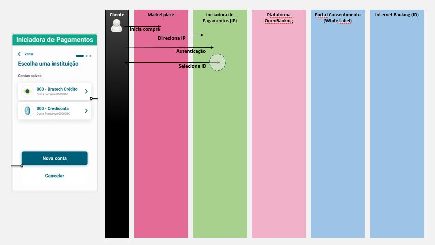
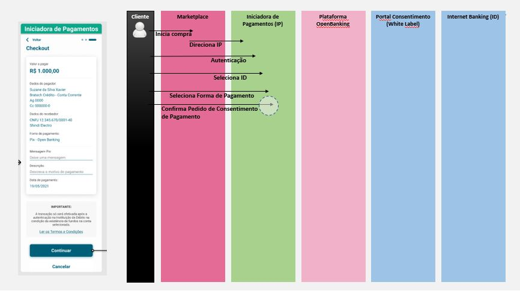

# Portal de Consentimento 
- [1. O que é o Portal do Consentimento?](#1-o-que-e-o-portal-do-consentimento-?)
- [2. Jornada de Usuário](#2-jornada-de-usuario)
  - [2.1 Fase 03 - Iniciação de Pagamento](#2.1-iniciação-de-pagamentos)
- [3. Diagrama de Sequência de Interface - Macro](#3-diagrama-de-sequência-de-interface---macro)
- [4. Padrão Visual](#4-guia-de-estilo-visual)
- [5. Fluxos de Autenticação e Autorização](#5-fluxos-de-autenticação-e-autorização)
- [6. Fluxo client Credentials](#4-fluxo-client-credentials)
- [7. Fluxo do Authorization Code](#5-fluxo-do-authorization-code)
- [8. Fluxo de Consentimento](#6-fluxo-de-consentimento)

# 1. O que é o Portal de Consentimento?
O Portal do Consentimento é o conjunto de interfaces que permite que os clientes das Instituições Financeiras façam a gestão de seus consentimentos.

É uma solução opcional oferecida pela TecBan para adequar a experiência do usuário em sua jornada de consentimento, atendendo os requisitos determinados pelo Grupo de Trabalho do OpenBanking Brasil

Atualmente, está em fase de construção para atendimento da Fase 03 do OpenBanking.

# 2. Jornadas de Usuário
Nos fluxos abaixo serão ilustradas as principais funcionalidades da 'Gestão de Consentimentos' pela perspectiva do usuário.

# 2.1. Fase 03 - Iniciação de Pagamentos

**Fluxo:** **Confirmar Consentimento de Pagamento Único - Alçada Única**

Navegue pelo protótipo (Clique)[aqui](https://www.figma.com/proto/aWwbavLPVAbx0H2AdnSQxi/Untitled?node-id=1%3A387&scaling=min-zoom&page-id=0%3A1)

# 3.Diagrama de Sequência de Interface - Visão Macro
As imagens abaixo ilustram a jornada de confirmação do consentimento de pagamento.
O objetivo é auxiliar no entendimento de qual ação está sendo executada e em qual ambiente ela ocorre, exibindo também a interface exibida ao usuário durante a execução.

- IP: Iniciadora de Pagamentos
- ID: Instituição Detentora de Conta

**Iniciação de Compra:**
Neste momento o cliente inicia a compra de um produto(TV) em um Marketplace, e opta por realizar o pagamento via 'OpenBanking'. 
Então ele é direcionado para a tela de autenticação da 'IP' parceira do Marketplace. 

**Seleção de 'ID' e Forma de Pagamento:**
Já autenticado na 'IP' o cliente seleciona de qual 'ID' que ele possui conta quer que o débito seja realizado.
No ambiente da 'IP' é possível o cliente cadastrar todas as suas contas para débito, e utilizá-las posteriormente.

**Continuação do Pedido de Consentimento de Pagamento:**
Nesta etapa, ainda na interface da 'IP' o cliente vê as informações detalhadas do consentimento que será solicitado, e então da continuidade no pedido.

**Criação do Consentimento**
Enquanto o cliente é direcionado para fazer a autenticação no Internet Banking da 'ID', a 'IP" inicia a solicitação da criação do consentimento do cliente para a 'Plataforma OpenBanking-TecBan'.
Neste momento sistemicamente o consentimento é criado.

**Autenticação e Direcionamento para o Portal de Consentimento-TecBan:**
Nesta jornada o cliente foi direcionado pela 'IP' para se autenticar no Internet Banking da 'ID', após realizar sua autenticação, ele é direcionado de forma transparente para o 'Portal de Consentimento-Tecban'

**Confirmação do Consentimento de Pagamento - Redirecionamento para 'IP':**
Já no ambiente do 'Portal de Consentimento-TecBan', o cliente vê as informações detalhadas do consentimento solicitado, e então confirma o consentimento, dando permissão para que a 'IP' solicite a efetivação do pagamento junto a 'ID'.
Após a confirmação, o cliente é redirecionado para o ambiente da 'IP'

Se preferir, faça o download da versão em PDF  

[Download do Diagrama de Sequência de Interfae - Visão Macro](https://1drv.ms/b/s!AmMxDxGhYOfggtZuAIZPSnApzrR6_A?e=mHQoHB)

**Consentimento Aprovado e Fluxo de Pagamento Realizado:**
Na etapa anterior o cliente aprovou o consentimento para pagamento e foi redirecionado para o ambiente da 'IP'. Neste momento a 'IP' inicia a solicitação de efetivação do pagamento para a 'Plataforma OpenBanking-TecBan', que então se comunica com a 'ID' para realização do pagamento. 
Enquanto esta comunicação sistêmica ocorre, fica a critério da 'IP' exibir interfaces da experiência do cliente.

# 4. Padrão Visual
Este item serve como guia de customização do 'Portal de Consentimento-TecBan' para Instituições parceiras.

A seguir é apresentado o que é possível customizar no Portal, para que cada Instituição possa oferecer uma melhor experiência ao seu cliente.

Também está disponível para do download o documento na qual as Insituições parceiras irão nos informar o seu padrão visual.

# 3. Fluxos de Autenticação e Autorização
Um Autorizador deve usar o protocolo OpenID Connect (OIDC) e o OAuth 2.0 Authorization Framework para autenticar usuários e obter sua autorização para acessar recursos protegidos.
A autenticação e a autorização representam funções fundamentalmente diferentes, conforme comparativo abaixo:

|Autenticação	|Autorização|
|-------------------------|
|Determina se os usuários são quem afirmam ser	|Determina o que os usuários podem e não podem acessar|
|Desafia o usuário a validar credenciais (por exemplo, por meio de senhas, respostas a perguntas de segurança ou reconhecimento facial)	|Verifica se o acesso é permitido por meio de políticas e regras|
|Normalmente feito antes da autorização	|Normalmente feito após autenticação bem-sucedida|
|Geralmente, transmite informações por meio de um token de ID	|Geralmente, transmite informações por meio de um token de acesso|
|Geralmente regido pelo protocolo OpenID Connect (OIDC)	|Geralmente regido pela estrutura OAuth 2.0|

<b>Camada de transporte</b>
A comunicação entre os aplicativos terceiros e os recursos protegidos, devem ser sempre protegidas utilizando uma conexão TLS versão 1.2 ou superior. A conexão TLS deve ser estabelecida sempre utilizando o certificado qualificado para a autenticação do site e o certificado deve ser emitido seguindo as normas definidas para o Open Banking

# 4. Fluxo Client Credentials
Com aplicativos machine-to-machine (M2M), como serviços em execução no back-end, o sistema autentica e autoriza o Client em vez de um usuário. Para este cenário, esquemas de autenticação típicos como nome de usuário + senha ou logins sociais não fazem sentido.

Em vez disso, as aplicações M2M usam o fluxo Client Credentials utilizando mTLS (definido em OAuth 2.0 Mutual-TLS Client Authentication and Certificate-Bound RFC 8705) e infraestrutura de chave pública (PKI). No qual o Client, o Authorization Server e o Servidor API são autenticados usando certificados X.509. O Access Token também é vinculado ao Client e validado utilizando certificados X.509.

Este método acrescenta uma restrição com chave de confirmação (ou prova de posse) ao Client que deseja utilizar um token emitido, com isso ele mitiga a possibilidade de uso abusivo dos Access Tokens Oauth tradicionais em caso de vazamento.

<b>Diagrama – Fluxo de credenciais do client.</b>

O client e o servidor de autenticação estabelecem uma conexão mTLS, e o Client solicita um Access Token.
O Servidor de Autenticação gera uma impressão digital SHA-256 do certificado do Client e a incorpora em um Access Token JWT. Isto limita o Access Token ao Client.
O servidor de autenticação emite o Access Token como uma resposta ao Client.
Os Clients fazem uma solicitação de recursos ao Servidor API usando o Access Token.
O Servidor de API solicita ao Authorization Server que valide o Access Token.
O Servidor API usa a impressão digital embutida para validar o Access Token.
O Servidor de Autenticação retorna o resultado da validação do token.
O Servidor API responde com o recurso solicitado.
Conforme definido na Seção 6.1 do RFC8705, os endpoints utilizados para emissão e validação de tokens que requerem uma conexão mTLS são endpoints convencionais separados por hostname ou porta diferente.

# 5. Fluxo do Authorization Code
No Fluxo do Authorization Code, o Client pode recuperar um Access Token e, opcionalmente, um Refresh Token. É considerada a escolha mais segura, pois o Access Token é passado diretamente para o servidor que hospeda o Client, sem passar pelo navegador do usuário e correr o risco de exposição.

Como os Clients são aplicativos do lado do servidor em que o código-fonte não é exposto publicamente, eles podem usar o fluxo do Authorization Code (definido no OAuth 2.0 [RFC 6749], seção 4.1 ), que troca um Authorization Code por um token. Seu Client deve estar no lado do servidor, porque durante essa troca, você também deve passar adiante o client secret do seu Client, que deve ser mantido sempre seguro, e deve armazená-lo em seu client.

<b>Diagrama - Fluxo do código de autorização.</b>

O usuário clica em Login no Client.
O client redireciona o usuário para o Authorization Server.
O Authorization Server redireciona o usuário para o prompt de login e autorização.
O usuário se autentica usando uma das opções de login configuradas e verá uma página de consentimento listando as permissões que o Autorizador dará ao Client.
O Authorization Server redireciona o usuário de volta ao client com um Authorization Code, que é válido para um uso.
O client envia esse código para o Authorization Server junto com o Client ID e o client secret do Client.
O Authorization Server verifica o código, o Client ID e o client secret do client.
O Authorization Server responde com um ID Token e um Access Token (e, opcionalmente, um Refresh Token).
O Client usa o Access Token para chamar uma API para acessar informações sobre o usuário.
A API responde com os dados solicitados.

# 6. Fluxo de Consentimento
Pedidos de revogação de consentimentos feitos pelo usuário final por meio de API´s da instituição receptora devem obrigatoriamente implicar na revogação dos tokens de acesso e de consentimento relacionados por meio de chamadas executadas no servidor de autorização da instituição transmissora responsável pelo consentimento e/ou em API de consentimento mantida pelo transmissor.
A instituição transmissora deve disponibilizar, por meio de API específica para o controle de consentimentos, interface que permita à instituição receptora detentora de consentimentos a verificação do seu estado.
O acesso à API de consentimento deve ser precedido de autenticação e a consulta deve ser restrita ao consentimento a que a instituição receptora teve autorização prévia para acesso, com vistas a garantir que apenas a instituição receptora que registrou o pedido de consentimento possa realizar a consulta sobre o seu estado. A instituição receptora de dados detentora de consentimentos e de tokens de autorização deve revogá-los, por meio de chamadas específicas às API´s das instituições transmissoras publicadas para esse fim, quando perceber violações à confidencialidade dos tokens ou no fim da prestação dos serviços ao usuário final.

<b>Padrão Lodging Intent</b>
Essa seção descreve o padrão Lodging Intent, utilizado para parametrizar solicitações de autorização OAuth complexas de maneira confiável e segura.
O OAuth por si, suporta apenas autorizar ações simples de leitura, o parâmetro scope é definido por uma lista delimitada por espaços contendo strings simples, quando se trata de autorizações mais complexas, como o início de um pagamento, o suporte integrado do OAuth não é suficiente. O padrão Lodging Intent pode ser utilizado para passar informações de forma confiável para o processo de autorização, independente das restrições de comprimento de URL, enquanto as informações também são protegidas contra modificação sem a necessidade de assiná-las digitalmente, reduzindo os custos de implementação. Executar um processo de autorização utilizando o padrão Lodging Intent e o Code Flow, funciona da seguinte maneira:

O client cria um recurso contendo todos os dados necessários para informar o processo de autorização no Authorization Server, a criação do Lodging Intent pode exigir uma autorização própria, nesse caso, o client precisa obter antecipadamente um Access Token com o escopo adequado, normalmente usando a concessão do Client Credentials com o* Authorization Server*.
O serviço de Lodging Intent responde ao client com um id e/ou link para o recurso criado.
O client então envia a referência do recurso com o pedido de autorização para o Authorization Server. O Authorization Server obtém os dados da transação do recurso de hospedagem e depois de autenticar o usuário, utiliza-os para apresentar uma interface de consentimento. Por exemplo, no caso de um pagamento, o Authorization Server mostra ao devedor, o valor e informações adicionais sobre a transação de pagamento ao usuário e pede o seu consentimento.

Se o usuário consentir com a autorização solicitada, o Authorization Server associa os dados de autorização à concessão criada (ou atualizada) e os respectivos Access Tokens emitidos com base nessa concessão. Por último, o Authorization Server precisa fornecer os dados de autorização ao respectivo Resource Server, para que seja incorporado no Access Token ou na resposta de Introspection do Token.
Mais detalhes sobre o funcionamento do padrão Lodging Intent pode ser consultado [aqui](https://bitbucket.org/openid/fapi/src/master/Financial_API_Lodging_Intent.md).

